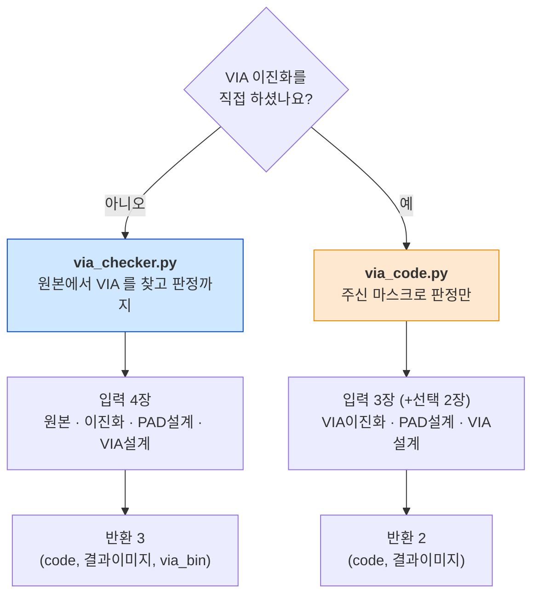
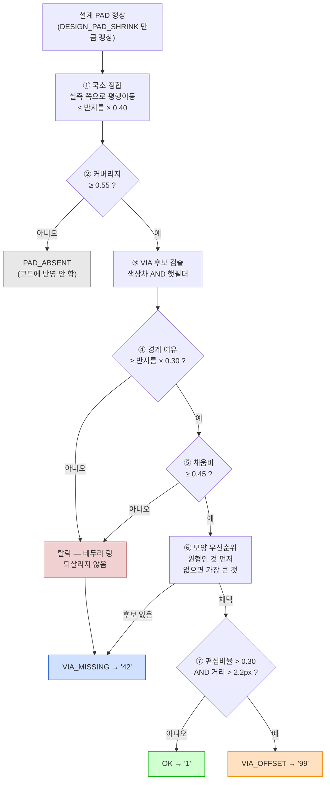
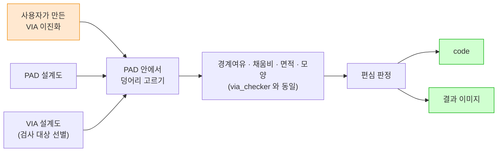
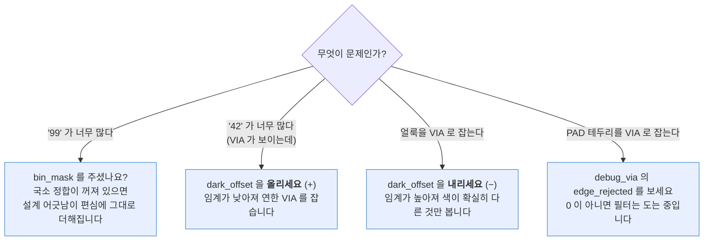

# 두 모듈 시각 설명서 — `via_checker.py` · `via_code.py`

그림으로 먼저 이해하는 문서입니다. 수치 근거와 실측 표는 [README.md](README.md),
엔진 내부 알고리즘은 [ALGORITHM.md](ALGORITHM.md) 를 보세요.

- [1. 둘 중 무엇을 쓸 것인가](#1-둘-중-무엇을-쓸-것인가)
- [2. `via_checker.py` — 찾고 판정한다](#2-via_checkerpy--찾고-판정한다)
- [3. VIA 를 어떻게 찾는가 — 색상차](#3-via-를-어떻게-찾는가--색상차)
- [4. 가짜 VIA 를 어떻게 거르는가](#4-가짜-via-를-어떻게-거르는가)
- [5. 어떻게 판정하는가 — 편심](#5-어떻게-판정하는가--편심)
- [6. `via_code.py` — 판정만 한다](#6-via_codepy--판정만-한다)
- [7. 결과 이미지 읽는 법](#7-결과-이미지-읽는-법)
- [8. 문제가 생겼을 때](#8-문제가-생겼을-때)

---

## 1. 둘 중 무엇을 쓸 것인가



두 모듈은 **판정 기준이 완전히 같습니다.** 다른 것은 "VIA 를 누가 찾느냐" 하나뿐입니다.

```
   via_checker.py                        via_code.py
   ┌────────────────────────────┐        ┌────────────────────────────┐
   │  ① VIA 를 찾는다            │        │  ① 사용자가 이미 찾음       │
   │     색상차 + 햇 필터        │        │     (마스크로 받음)         │
   │  ────────────────────────  │        │  ────────────────────────  │
   │  ② 가짜를 거른다            │  같음  │  ② 가짜를 거른다            │
   │  ③ 편심으로 판정한다        │ ←───→ │  ③ 편심으로 판정한다        │
   │  ④ 결과 이미지를 그린다     │        │  ④ 결과 이미지를 그린다     │
   └────────────────────────────┘        └────────────────────────────┘
```

그래서 `via_checker` 가 준 `via_bin` 을 `via_code` 에 그대로 넣으면 **같은 코드**가
나옵니다 (테스트셋 44장 / PAD 777개 전부 일치).

### 코드 4가지

| code | 뜻 | 결과 이미지 마커 |
|---|---|---|
| `"1"` | 양품 | 초록 원 |
| `"42"` | VIA 없음 | 빨강 X |
| `"99"` | VIA 쏠림 | 주황 원 + 화살표 |
| `"-1"` | 입력 오류 | (이미지 `None`) |

한 이미지에 `42` 와 `99` 가 같이 있으면 **`42` 가 이깁니다** (결손이 위치오차보다 중대).

---

## 2. `via_checker.py` — 찾고 판정한다

```python
from via_checker import check_via

code, result, via_bin = check_via("board.png", "board_bin.png",
                                  "pad_cad.png", "via_cad.png")
```

### 입력 4장이 각각 하는 일

```
  ① 원본 (BGR)              ② 이진화 (실측 PAD)
  ┌──────────────┐          ┌──────────────┐
  │ ▓▓▓▓   ▓▓▓▓ │          │ ████   ████ │
  │ ▓▓●▓   ▓▓▓▓ │          │ ██ █   ████ │   VIA 자리는 구멍으로 남음
  │ ▓▓▓▓   ▓▓▓▓ │          │ ████   ████ │   (메우지 않습니다)
  └──────────────┘          └──────────────┘
   VIA 를 찾는 원본           PAD 가 실제로 있는지 + 정합 기준

  ③ PAD 설계도              ④ VIA 설계도
  ┌──────────────┐          ┌──────────────┐
  │ ████   ████ │          │              │
  │ ████   ████ │          │  ·           │   점이 찍힌 PAD 만 검사
  │ ████   ████ │          │              │   (오른쪽 PAD 는 대상 아님)
  └──────────────┘          └──────────────┘
   '정중앙' 의 기준            검사 대상 선별
```

**검사 대상은 ④ 로만 정합니다.** VIA 설계도에 점이 없는 PAD 는 아예 건드리지 않습니다.

### 한 PAD 를 처리하는 전체 흐름



**④⑤ 는 탈락, ⑥ 은 선호.** 성격이 다릅니다.

```
   ⑥ 모양 (선호)                    ④⑤ 경계여유·채움비 (탈락)
   ┌───────────────────┐            ┌───────────────────┐
   │ 원형 후보가 없으면 │            │ 걸린 것은 후보 목록 │
   │ 모양을 포기하고    │            │ 에서 아예 빠진다    │
   │ 가장 큰 것을 쓴다  │            │ 되살아나지 않는다   │
   └───────────────────┘            └───────────────────┘
     → VIA_MISSING 을                  → VIA_MISSING 을
       새로 만들 수 없다                  만들 수 있다 (의도된 것)
```

⑥ 을 탈락으로 만들면 **긁힘이 진짜 VIA 를 가로질러 한 덩어리로 붙었을 때**
멀쩡한 PAD 가 `VIA_MISSING` 으로 둔갑합니다. 그래서 선호로 둡니다.

---

## 3. VIA 를 어떻게 찾는가 — 색상차

> **"PAD 안에서 PAD 색과 다르면 VIA 다."** 이 한 문장을 그대로 수식으로 옮긴 것입니다.

### 예전 방식과 무엇이 달라졌나

```
   [ 예전 — 밝기 비율 ]                 [ 지금 — 색상차 ]

   임계 = PAD밝기중앙값 × 0.62          색상차 = |화소BGR − PAD대표색BGR| 세 채널 합
   후보 = 이보다 어두운 픽셀            임계  = 색상차중앙값 + 3.5 × 로버스트편차
                                        후보  = 이보다 색이 다른 픽셀

   ✘ PAD 색이 라인마다 다르면 어긋남    ✔ PAD 마다 자기 색이 기준
   ✘ 연한 VIA 는 0.62 를 못 넘음        ✔ 그 PAD 의 색 산포로 재므로 연해도 넘음
   ✘ PAD 보다 '밝은' 이물은 못 잡음     ✔ 밝든 어둡든 '다르면' 잡음
```

### 계산 과정

```
   PAD 내부 화소들
   ┌─────────────────┐
   │ ▓▓▓▓▓▓▓▓▓▓▓▓▓ │   ① 대표색 = PAD 내부 BGR 의 중앙값
   │ ▓▓▓▓●●▓▓▓▓▓▓ │      (중앙값이라 VIA 자체에 안 끌려감)
   │ ▓▓▓▓●●▓▓▓▓▓▓ │
   │ ▓▓▓▓▓▓▓▓▓▓▓▓▓ │   ② 색상차 = |자기색 − 대표색| 세 채널 더하기
   └─────────────────┘
            │
            ▼
   색상차 히스토그램
                                            임계
     ████████████                             ┊
     ████████████                             ┊        ▂▂
     ████████████▁                            ┊       ████
   ──┴──────────────────────────────────────┴────────────→ 색상차
     0        PAD 표면 (중앙값 근처)          ↑          VIA
                                    중앙값 + 3.5 × 로버스트편차

   ③ 로버스트편차 = 1.4826 × MAD(색상차)      ← 이상치에 안 끌리는 표준편차
      단, COLOR_FLOOR(6.0) 아래로는 안 내려감  ← 너무 매끈한 PAD 에서 임계 붕괴 방지
```

`MAD` = 중앙값 절대편차(Median Absolute Deviation). 평범한 표준편차를 쓰면 **VIA 자신이
편차를 키워** 임계가 VIA 위로 올라가 버립니다. MAD 는 소수의 이상치에 끌려가지 않습니다.

### 2차 조건 — 햇(hat) 필터

색상차만 쓰면 **PAD 테두리의 색 전이 영역**이 통째로 딸려 옵니다.

```
   Black-hat / Top-hat 이 푸는 것

   PAD 테두리 (단조 경사)          VIA (고립된 우물)
        밝기                            밝기
   ─────╲                          ─────╲    ╱─────
         ╲                                ╲╱
          ╲───                            VIA
   closing 해도 거의 그대로         closing 이 주변 밝기로 메움
   → 햇 응답 ≈ 0  (탈락)           → 햇 응답 큼   (통과)
```

- **Black-hat** = closing − 원본 → **어두운** 점에 반응
- **Top-hat** = 원본 − opening → **밝은** 점에 반응
- 두 응답 중 **큰 쪽**을 씁니다 → "다르면 VIA" 라는 정의에 맞춤

```
   최종 후보 = (색상차 > 임계)  AND  (max(블랙햇, 탑햇) > 햇임계)  AND  (PAD 내부)
```

> **`MORPH_OPEN` 을 걸지 마세요.** 연한 VIA 는 후보가 5px 밖에 안 됩니다.
> `2×2` 열림 연산 한 번에 통째로 지워집니다 (실측으로 확인된 버그).
> 잡티 제거는 연결성분 면적 하한(`VIA_MIN_AREA = 4`) 하나로만 합니다.

---

## 4. 가짜 VIA 를 어떻게 거르는가

실물 이미지의 최대 골칫거리는 **PAD 테두리를 두른 어두운 링**입니다.
모양만 보면 **완벽한 원**이고 무게중심도 PAD 중심과 겹칩니다.

```
   테두리 링                              그래서 이렇게 됩니다
   ┌─────────────────┐
   │ ███████████████ │   장단비    1.04  ← 완벽한 원
   │ █             █ │   반경편차  0.177 ← 완벽한 원
   │ █             █ │   무게중심  PAD 중심과 일치
   │ █             █ │   편심비율  0.082 ← 정중앙
   │ ███████████████ │
   └─────────────────┘   ⇒ VIA 가 아예 없는 PAD 가 "양품" 으로 둔갑 (불량 놓침)
```

이건 **모양으로는 절대 못 잡습니다.** 두 가지를 겹쳐서 막습니다.

### 필터 ④ 경계 여유 — "위치를 본다"

```
   진짜 VIA                          테두리 링
   ┌─────────────────┐               ┌─────────────────┐
   │                 │               │ ███████████████ │
   │       ●●●       │               │ █             █ │
   │       ●●●   ↕   │ 경계까지 멀다  │ █             █ │  경계에 딱 붙음
   │             8px │               │ ███████████████ │  ↕ 1~2px
   └─────────────────┘               └─────────────────┘

   덩어리 안에서 PAD 경계로부터 가장 먼 픽셀의 거리 (distanceTransform)
     진짜 VIA   최소 0.536  중앙 0.965   ← PAD 반지름으로 나눈 값
     테두리 링  중앙 0.254  p1  0.086
                            ↑ 임계 0.30 이 둘을 가른다
```

### 필터 ⑤ 채움비 — "전체 모양을 본다"

경계 여유만으로는 **부족합니다.** 덩어리 안의 **가장 깊은 한 점**만 보기 때문에,
링이 두껍게 잡히면 그 한 점이 임계를 아슬아슬하게 넘어 통과합니다.

```
   실측된 뚫림 사례 :  최대 경계거리 8.00  vs  임계 7.71   → 통과해 버림
```

그래서 덩어리 **전체 모양**도 같이 봅니다.

```
                 덩어리 면적
   채움비 = ─────────────────────
             그 덩어리의 최소외접원 면적

   꽉 찬 원                           링 / 호(弧)
   ┌─────────────────┐               ┌─────────────────┐
   │    ╭───────╮    │               │  ╭───────────╮  │
   │   ╱ ███████ ╲   │               │ ╱ ██████████ ╲ │
   │  │ █████████ │  │               ││ █         █ ││
   │   ╲ ███████ ╱   │               │ ╲ ██████████ ╱ │
   │    ╰───────╯    │               │  ╰───────────╯  │
   └─────────────────┘               └─────────────────┘
     0.6 ~ 0.9                          0.2 아래
                    임계 0.45 가 둘을 가른다
```

**왜 최소외접원인가.** 링이 이미지 끝에서 잘려 **열린 C 자**가 되는 경우가 있습니다.
이때 윤곽선을 채워서 재는 방식은 **호 자체를 채워** 비율이 1.0 이 나와 뚫립니다.
최소외접원은 열린 C 자에서도 그대로 크므로 값이 낮게 유지됩니다.

```
   닫힌 링              열린 C (이미지 끝에서 잘림)
   ╭─────╮              ╭─────
   │     │              │           윤곽 채우기 → 1.0  ✘ 뚫림
   ╰─────╯              ╰─────      최소외접원   → 0.1  ✔ 막힘
```

### 두 필터를 넣고 무엇이 달라졌나

| 구성 | 테스트셋 PAD | 편심 분리 마진 | 실물 49장 오검출 |
|---|---|---|---|
| 예전 (밝기 비율) | 772 / 783 | 0.314 | 146 |
| 채움비만 추가 | 770 / 783 | 0.310 | 9 |
| **색상차 + 채움비** | **772 / 783** | **0.318** | **7** |

둘 다 필요합니다. 채움비만 넣으면 **연한 VIA 2개를 잃고**, 색상차가 그걸 되찾으면서
오검출을 더 줄입니다.

실제 이미지 검증 (VIA 가 하나도 없는 42 PAD 짜리 실물) — 오검출 **3 → 0**.

---

## 5. 어떻게 판정하는가 — 편심

```
                ‖VIA중심 − PAD중심‖
   편심비율 = ────────────────────      (PAD 크기와 무관한 무차원 값)
                  PAD 등가반지름
```

```
   정상 (OK)                          쏠림 (VIA_OFFSET)
   ┌─────────────────┐               ┌─────────────────┐
   │                 │               │                 │
   │       ╭─╮       │               │   ╭─╮           │
   │       │●│ ←중심 │               │   │●│      ×    │ ← PAD 중심
   │       ╰─╯       │               │   ╰─╯           │
   │                 │               │                 │
   └─────────────────┘               └─────────────────┘
    편심비율 0.05                       편심비율 0.52
```

**두 조건을 모두 넘어야 불량**입니다.

```
   상대 : 편심비율 > 0.30      ← 스케일 불변
   절대 : 편심거리 > 2.2 px    ← 작은 PAD 의 반올림 오차 흡수
                AND
```

실측 분리도 — 정상 최대 **0.097** vs 쏠림 최소 **0.415**. 임계 0.30 은 그 사이에서
정상 쪽에 여유를 둔 값이고, 마진이 **0.318** 남습니다.

### VIA 중심은 무게로 잽니다

단순 화소 무게중심이 아니라 **임계를 얼마나 넘었는지**로 가중합니다.

```
   가중치 = max(색상차 − 임계, 0)

   ░░▒▓█▓▒░░      경계 화소(약하게 넘음)는 가볍게
     └─┴─┘        코어 화소(크게 넘음)는 무겁게
       ↑
     중심이 코어 쪽으로 정확히 수렴 → 서브픽셀 정밀도
```

---

## 6. `via_code.py` — 판정만 한다

```python
from via_code import check_via_code

code, result = check_via_code(VIA이진화, PAD설계도, VIA설계도, bin_mask=이진화)
cv2.imwrite("result.png", result)
```



### `bin_mask` 는 되도록 같이 주세요

실측 PAD 마스크입니다. VIA 를 찾는 데는 **안 씁니다**(그건 이미 하셨으니까).
**기준점**을 잡는 데만 씁니다.

```
   ① 국소 정합                        ② PAD 누락 구분

   설계도            실물             설계 자리        실물
   ┌───────┐        ┌───────┐        ┌───────┐      ┌───────┐
   │ ████  │        │  ████ │        │ ████  │      │       │  PAD 자체가 없음
   │ ████  │  vs    │  ████ │        │ ████  │  vs  │       │
   └───────┘        └───────┘        └───────┘      └───────┘
      2~3px 어긋남                       ↓                ↓
      → 편심 0.3~0.5 가 그냥 나옴     bin_mask 없으면 "42"(VIA 없음)
      → 멀쩡한 VIA 가 "99"            bin_mask 있으면 PAD_ABSENT 로 제외
```

| | `bin_mask` 안 주면 | 주면 |
|---|---|---|
| 국소 정합 | 설계-실물 어긋남이 편심에 그대로 더해짐 → `"99"` 증가 | 계통 오차 제거 |
| PAD 누락 구분 | PAD 가 없는 자리도 `"42"` | `PAD_ABSENT` 로 빼둠 |

실측으로 **테스트셋 44장 중 5장**이 이 차이 하나 때문에 `"1"` 대신 `"42"` 가 나왔습니다.

### 결과 이미지의 바탕

이 모듈은 원본 사진을 안 받는 게 기본이라 **그릴 바탕이 없습니다.**

```
   image=원본 을 준 경우          안 준 경우 (마스크 합성 배경)
   ┌────────────────────┐        ┌────────────────────┐
   │  실제 사진 위에     │        │  검정   빈 곳       │
   │  마커만 얹음        │        │  진회색 PAD 설계도  │
   │                    │        │  중간   실측 PAD    │
   │                    │        │  밝은회 준 VIA      │
   └────────────────────┘        └────────────────────┘
     눈으로 보기 좋음                원본 없이도 확인 가능
```

**판정 결과는 배경과 무관하게 완전히 같습니다.** `image` 는 그리기에만 씁니다.

### 사용자 이진화에 테두리 링이 섞여 있어도 안전합니다

경계 여유와 채움비 필터가 이 모듈에도 그대로 들어 있습니다.

| 넣은 마스크 | 결과 | 탈락 |
|---|---|---|
| 중앙 VIA | `"1"` | 0 |
| 쏠린 VIA | `"99"` | 0 |
| **테두리 링만** (VIA 없음) | **`"42"`** | 1 |
| 테두리 링 + 중앙 VIA | `"1"` (VIA 를 제대로 고름) | 1 |
| 빈 마스크 | `"42"` | 0 |

### 주의 — 상수를 한쪽만 고치면 판정이 갈립니다

튜닝 값은 `via_checker.py` 와 **같은 값을 복제**해 두었습니다.
두 모듈을 같이 쓰신다면 임계값을 바꿀 때 **양쪽 다** 고치세요.

---

## 7. 결과 이미지 읽는 법

**원본과 같은 해상도**에 마커만 그립니다. 텍스트 바나 여백을 붙이지 않습니다.

```
   ┌──────────────────────────────────────────────┐
   │                                              │
   │    ╭───╮        ╭───╮         ╲   ╱         │
   │   │ ◌ │       │ ◌  │         ╲ ╱          │
   │    ╰───╯        ╰───╯          ╱ ╲          │
   │    초록          주황+화살표    ╱   ╲  빨강X  │
   │    양품          쏠림           VIA 없음      │
   │                                              │
   │            ╭───╮                             │
   │           │     │  회색 = PAD 없음            │
   │            ╰───╯   (코드에 반영 안 함)         │
   └──────────────────────────────────────────────┘
```

| 마커 | 색 | 뜻 |
|---|---|---|
| 원 | 초록 | 정상 (`"1"`) |
| 원 + 화살표 | 주황 | VIA 쏠림 (`"99"`). 화살표는 PAD중심 → VIA중심 |
| X | 빨강 | VIA 없음 (`"42"`) |
| 원 | 회색 | PAD 없음. 코드에 반영 안 함 |
| **작은 원 + 중심점** | **하늘색** | **찾아낸(고른) VIA. 판정과 무관하게 항상** |

**하늘색 원이 진단의 핵심입니다.** 원 크기는 실제로 검출된 덩어리 크기이므로,

```
   하늘색 원이 PAD 중앙에 작게    → 정상 검출
   하늘색 원이 PAD 테두리를 따라  → 오검출. dark_offset 을 내리세요
   하늘색 원이 아예 없음          → 미검출. dark_offset 을 올리세요
```

---

## 8. 문제가 생겼을 때



### `dark_offset` 조절

```
   임계 = 색상차중앙값 + 3.5 × 로버스트편차 − dark_offset
                                              └─ 기본 0

   dark_offset ↓ (음수)   임계 ↑   색이 확실히 다른 것만 VIA   얼룩 무시 / 연한 VIA 도 놓침
   dark_offset ↑ (양수)   임계 ↓   조금만 달라도 VIA          연한 VIA 검출 / 얼룩도 딸려옴
```

부호 방향은 예전(밝기 기준)과 **같습니다.** 단위만 밝기(0\~255)에서 세 채널 합으로
바뀌어 대략 **3배 스케일**이니, 예전에 `-8` 을 쓰셨다면 `-24` 쯤부터 보세요.
한 번에 크게 움직이지 말고 `-15` 정도씩 옮기면서 확인합니다.

### 수치를 직접 보기

```python
from via_checker import debug_via

code, result, via_bin, rows = debug_via(원본, 이진화, PAD설계도, VIA설계도)
```

`rows` 에서 특히 볼 것:

| 키 | 이럴 때 봅니다 |
|---|---|
| `dark_threshold` | `dark_offset` 을 얼마나 옮겼는지 확인 |
| `edge_rejected` | 테두리 링·채움비로 탈락한 후보 수 |
| `shape_rejected` | 모양으로 뒤로 밀린 후보 수 (되살아날 수 있음) |
| `offset_norm` | 편심비율. 0.30 을 넘었는지 |
| `pad_coverage` | 0.55 미만이면 `PAD_ABSENT` |
| `via_area` | 너무 크면 얼룩을 통째로 잡은 것 |

`via_code.py` 는 `verbose=True` 로 같은 표를 볼 수 있고, 이때 결과 이미지에
PAD 번호도 같이 달립니다.

```python
code, result = check_via_code(VIA이진화, PAD설계도, VIA설계도,
                              bin_mask=이진화, verbose=True)
```

### 그래도 안 되면

`via_bin` 을 저장해서 눈으로 보세요. **흰 픽셀 = 이 판정의 근거** 그 자체입니다.

```python
cv2.imwrite("via_bin.png", via_bin)
```

| | `via_bin` 에 |
|---|---|
| VIA 로 **채택한** 덩어리 | 들어감 |
| `VIA_MISSING` / `PAD_ABSENT` 인 PAD | 안 찍힘 |
| 면적·경계여유·채움비에서 **탈락**한 덩어리 | 안 찍힘 |
| 검사 대상이 아닌 PAD | 안 건드림 |
