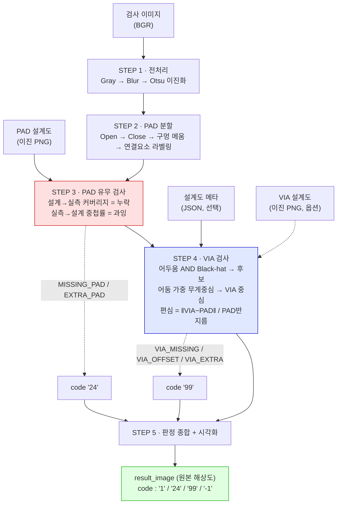
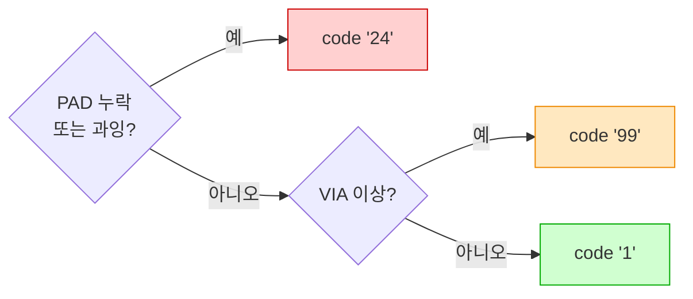
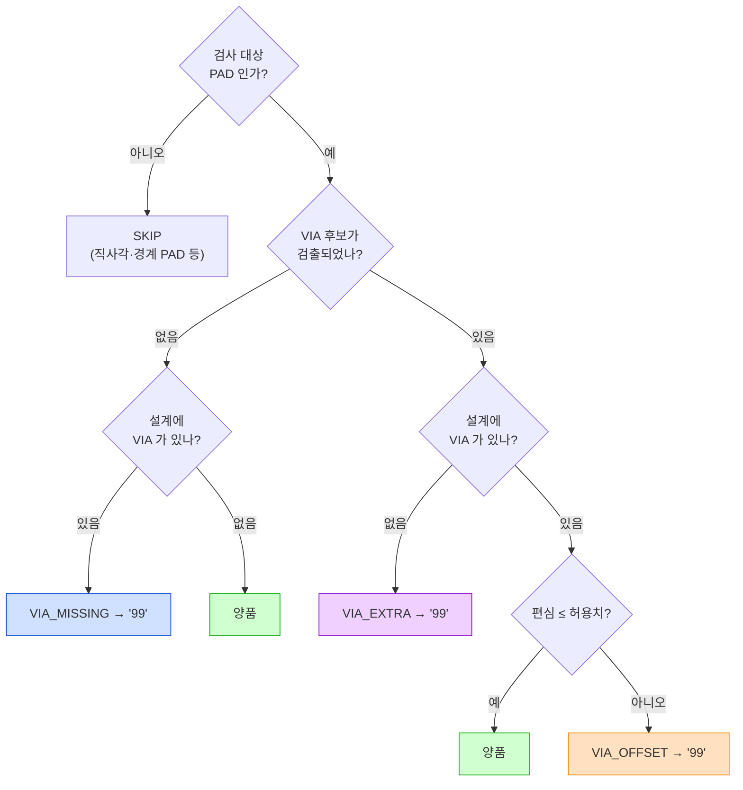
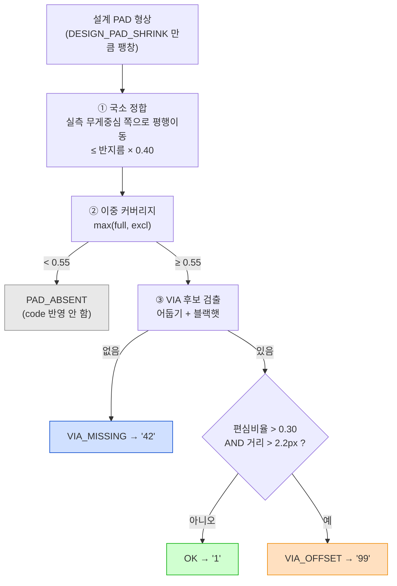

# PAD / VIA 검사기

PCB PAD 와 VIA(중앙 검은 점)를 설계도와 대조해 검사하는 순수 OpenCV 기반 파이프라인입니다.
딥러닝·학습 데이터 없이 **고전 영상처리만** 사용합니다.

| 코드 | 의미 |
|---|---|
| `"1"` | 양품 |
| `"24"` | PAD 누락 / PAD 과잉 (설계도 불일치) |
| `"99"` | VIA 없음 / VIA 편심(쏠림) / VIA 과잉 |
| `"-1"` | 처리 실패 |

> 판정 코드는 `int` 가 아니라 **`str`** 로 반환됩니다.

---

## 파일 구성

| 파일 | 역할 |
|---|---|
| **`pad_via_inspector.py`** | **검사 엔진 (단일 파일, 복붙용).** 이 파일 하나만 있으면 동작합니다 |
| **`via_checker.py`** | **VIA 검사만 떼어낸 단독 모듈.** 이미 준비된 이미지 4개를 받아 VIA만 판정 (없음 `"42"` / 쏠림 `"99"` 분리, 국소 정합·이중 커버리지 포함) |
| `make_testset.py` | 원본 이미지에 VIA·결함을 주입해 테스트셋과 설계도를 생성 |
| `run_inspection.py` | 테스트셋 전체를 검사하고 정답과 대조해 정확도 리포트 |
| `eval_padlevel.py` | PAD 단위 혼동행렬 + 편심 임계값 분리도 분석 |
| `ALGORITHM.md` | **알고리즘·로직 상세 문서** (설계 근거, 실패 이력, 튜닝 가이드 포함) |

의존성은 `opencv-python`, `numpy` 뿐입니다. **Python 3.9+**.

```bash
pip install opencv-python numpy
```

---

## 동작 원리

### 전체 파이프라인



`구멍 메움` 이 핵심입니다. VIA 는 PAD 안의 어두운 점이라 이진화하면 **PAD 에 구멍이 뚫린 형태**가 됩니다.
이 구멍을 메워야 PAD 를 온전한 덩어리로 셀 수 있고, 메워낸 구멍 자체가 VIA 후보가 됩니다.

### 판정 우선순위



PAD 자체가 틀렸다면 그 위의 VIA 판정은 의미가 없으므로 **`"24"` 가 `"99"` 보다 우선**합니다.
둘 다 발생하면 `code = "24"`, `codes = ["24", "99"]` 로 **모든 코드를 함께** 돌려줍니다.

### VIA 판정 로직



`설계에 VIA 가 있나?` 분기는 **`via_design_check=True` 일 때만** 실제로 갈라집니다.
꺼져 있으면 "검사 대상 PAD 에는 VIA 가 있어야 한다"가 기본 전제라 항상 `있음` 으로 처리되고,
따라서 `VIA_EXTRA` 는 발생하지 않습니다.

### 편심(offset) 계산

편심은 **PAD 등가반지름으로 정규화**하므로 PAD 크기가 달라도 같은 기준이 적용됩니다.

```
            ┌─────────────────┐
            │   설계 PAD 형상  │   ← 기준 형상은 설계도에서 가져온다
            │    ╭───────╮    │      (VIA 때문에 생긴 노치에 영향받지 않음)
            │   ╱    +    ╲   │   + = PAD 중심
            │  │     ↘     │  │   ● = VIA 중심 (어둠 가중 무게중심, 서브픽셀)
            │   ╲     ●   ╱   │   ↘ = 편심 벡터
            │    ╰───────╯    │
            └─────────────────┘

    offset_norm = ‖VIA중심 − PAD중심‖ / PAD등가반지름       (등가반지름 = √(면적/π))

    불량 판정 = (offset_norm > 0.25)  AND  (실제거리 > 2.2px)
                 └─ 상대 기준 ─┘         └─ 절대 하한 ─┘
```

**두 조건을 모두** 넘어야 불량입니다. 작은 PAD 에서는 1px 의 픽셀 양자화만으로도
상대 편심이 커 보이므로, 절대 하한이 없으면 오검출이 납니다.

### 실측 편심 분포 — 왜 이 임계값인가

테스트셋 676개 VIA 의 `offset_norm` 실측 분포입니다 (막대는 그룹별로 따로 정규화).

```
 offset_norm │ 정상 (center) n=641          │ 쏠림 (shift) n=35
─────────────┼──────────────────────────────┼────────────────────────────
  0.00–0.05  │ ████████████████████████ 308 │
  0.05–0.10  │ ███████████████████████  294 │
  0.10–0.15  │ ███                      39  │
  0.15–0.20  │                          0   │
  0.20–0.25  │                          0   │   ← 판정 임계값 0.25
  0.25–0.30  │                          0   │
  0.30–0.35  │                          0   │        비어 있는 구간
  0.35–0.40  │                          0   │        (분리 마진)
  0.40–0.45  │                              │ ████████████████       6
  0.45–0.50  │                              │ ████████████████████████ 9
  0.50–0.55  │                              │ ████████████████████████ 9
  0.55–0.60  │                              │ ████████████████       6
  0.60–0.65  │                              │ ████████               3
  0.65–0.70  │                              │ ██                     1
  0.70–0.75  │                              │ ██                     1
─────────────┴──────────────────────────────┴────────────────────────────
  정상 최댓값 0.131 │←── 분리 마진 0.282 ──→│ 0.413 쏠림 최솟값
```

두 분포 사이가 **완전히 비어 있습니다.** 임계값을 0.15 ~ 0.40 중 어디에 두어도 결과가 같습니다.
즉 **파라미터를 데이터에 맞춰 끼워맞춘 것이 아닙니다.**

### 결과 이미지 마커

```
   ┌────────────────────────────────────────────┐
   │   ╭──────╮        ╭──────╮                 │
   │   │  ╶┼╴ │        │  ╶┼╴↘│      ╭┄┄┄┄╮     │
   │   ╰──────╯        ╰──────╯      ┆ ✕  ┆     │
   │    노랑 십자       주황 십자+화살표  빨강 원+X │
   │    VIA 정상        VIA 편심        PAD 누락  │
   │                                            │
   │   ╭──────╮        ╭──────╮      ╭┄┄┄┄╮     │
   │   │  ╶┼╴ │        │      │      ┆    ┆     │
   │   ╰──────╯        ╰──────╯      ╰┄┄┄┄╯     │
   │    보라 십자        파랑 원       자홍 원    │
   │    VIA 과잉         VIA 없음      PAD 과잉  │
   └────────────────────────────────────────────┘
     녹색 외곽선 = 정상 PAD
```

텍스트 바나 여백은 **그리지 않습니다.** `result_image.shape == 입력.shape` 이 항상 보장됩니다.

---

## 빠른 시작

### 1) 원샷 모드

```python
from pad_via_inspector import inspect
import cv2

res = inspect("board.png", "board_cad.png", "board_cad.json")

print(res.code)      # "1" / "24" / "99" / "-1"
print(res.codes)     # 예: ["24", "99"]
print(res.ok)        # True / False
print(res.message)   # 'MISSING_PAD x1, VIA_OFFSET x2'

cv2.imwrite("out.png", res.result_image)   # 입력과 동일 해상도

for d in res.defects:
    print(d.kind, d.pad_id, d.position, d.detail)
```

예외가 나도 던지지 않고 `code = "-1"` 인 결과 객체를 반환하므로,
배치 처리 중 한 장 때문에 전체가 멈추지 않습니다.

### 2) 단계별 모드 (중간 결과 확인)

```python
from pad_via_inspector import (InspectConfig, step1_preprocess, step2_segment_pads,
                               step3_check_pad_presence, step4_check_via, step5_render)

cfg  = InspectConfig()

pre  = step1_preprocess("board.png", cfg)          # 전처리 · 이진화
seg  = step2_segment_pads(pre, cfg)                # PAD 분할 · 구멍 메움
pres = step3_check_pad_presence(seg, "board_cad.png", cfg)   # PAD 누락/과잉  -> "24"
via  = step4_check_via(pre.bgr, seg, pres, "board_cad.json", cfg)  # VIA 검사 -> "99"
res  = step5_render(pre.bgr, seg, pres, via, cfg)  # 종합 · 시각화

print(pre.threshold, len(seg.pads), len(pres.missing), res.code)
```

각 단계 결과가 독립 객체이므로 **임의 단계만 교체·재실행** 할 수 있습니다.

### 3) CLI

```bash
python pad_via_inspector.py board.png board_cad.png \
       --meta board_cad.json --out result.png
```

판정 결과는 stdout 에 JSON 으로 출력됩니다. 프로세스 종료 코드는 **양품 0 / 불량 1**.

---

## VIA 설계도 대조 (옵션)

VIA 도 설계도가 있는 경우, **설계에 있는데 없는 VIA(`VIA_MISSING`)** 와
**설계에 없는데 있는 VIA(`VIA_EXTRA`)** 를 함께 잡을 수 있습니다.
기본값은 **꺼짐**이며, 껐을 때의 동작은 기존과 완전히 동일합니다.

VIA 설계도는 검사 이미지와 같은 크기의 **이진 PNG** 로, 설계상 VIA 가 있어야 할 위치에만 흰 점을 찍습니다.

```python
from pad_via_inspector import InspectConfig, inspect

cfg = InspectConfig(via_design_check=True)
res = inspect("board.png", "board_cad.png", "board_cad.json", cfg, "board_via.png")
```

```bash
python pad_via_inspector.py board.png board_cad.png --meta board_cad.json \
       --via-design board_via.png --out result.png
```

판정 규칙:

| 설계 VIA | 실물 VIA | 판정 |
|---|---|---|
| 있음 | 있음 · 정중앙 | 양품 |
| 있음 | 있음 · 쏠림 | `VIA_OFFSET` → `"99"` |
| 있음 | 없음 | `VIA_MISSING` → `"99"` |
| 없음 | 있음 | `VIA_EXTRA` → `"99"` |
| 없음 | 없음 | 양품 |

설계 마스크는 헬퍼로 만들 수 있습니다.

```python
from pad_via_inspector import build_via_design_mask
mask = build_via_design_mask((220, 220), [(150.5, 32.1), (180.6, 32.1)], radius=2)
```

---

## VIA 검사만 쓰기 — `via_checker.py`

이진화와 설계도가 **이미 준비되어 있고** VIA 판정만 필요할 때 쓰는 단독 모듈입니다.
`pad_via_inspector.py` 없이 **이 파일 하나만** 다른 프로젝트에 붙여 넣으면 됩니다.

```
   원본 이미지 ─┐
   이진화 마스크 ─┤                             ┌─→ code   "1" / "42" / "99" / "-1"
   PAD 설계도  ─┤──→  check_via(4개)  ──────┤
   VIA 설계도  ─┘                             └─→ result  마커가 그려진 결과 이미지
```

| code | 뜻 | 마커 |
|---|---|---|
| `"1"` | 양품 | 초록 원 |
| `"42"` | **VIA 없음** | 빨강 X |
| `"99"` | **VIA 쏠림** | 주황 원 + 편심 화살표 |
| `"-1"` | 입력 오류 (`result` 는 `None`) | — |

### 입력 4개

| # | 인자 | 내용 |
|---|---|---|
| 1 | `image` | 원본 이미지 (BGR/GRAY ndarray 또는 경로) |
| 2 | `bin_mask` | 원본의 이진화 결과 = 실측 PAD 마스크 |
| 3 | `pad_design` | PAD 설계도 (이진) |
| 4 | `via_design` | VIA 설계도 (이진) |

네 이미지는 **같은 해상도·같은 좌표계**여야 합니다. 크기가 다르면 조용히 리사이즈하지 않고 `"-1"` 로 실패합니다.

### 검사 대상

**VIA 설계도에 점이 찍힌 PAD만** 검사합니다.
VIA 설계도의 각 연결요소 무게중심이 어느 설계 PAD 안에 있는지로 대상을 결정하며,
설계상 VIA 가 없는 PAD 는 아예 건드리지 않습니다.

```python
from via_checker import check_via

code, result = check_via("board.png", "board_bin.png", "pad_cad.png", "via_cad.png")

# code   : "1"  양품
#          "42" VIA 없음
#          "99" VIA 쏠림
#          "-1" 입력 오류 (result 는 None)
# result : 원본과 같은 해상도의 결과 이미지 (ndarray)
```

한 이미지에 없음과 쏠림이 같이 있으면 **`"42"` 가 이깁니다** (결손이 위치오차보다 중대).

함수 하나, 인자 4개, 반환 2개가 전부입니다. 설정 객체·플래그·CLI 인자 없음,
JSON 도 파일 저장도 하지 않습니다. 저장이 필요하면 호출한 쪽에서 `cv2.imwrite` 하면 됩니다.

### 디버깅

수치가 궁금하면 `debug_via` 를 쓰세요. 인자는 똑같고 반환만 하나 늘어납니다.

```python
from via_checker import debug_via

code, result, rows = debug_via("board.png", "board_bin.png", "pad_cad.png", "via_cad.png")
```

- PAD 별 수치가 표로 출력됩니다 (`quiet=True` 로 끄기)
- 결과 이미지에 **PAD 번호**가 함께 그려집니다
- `rows` 로 원시값을 직접 받습니다

```
code=42   검사대상 11개   OK=7  VIA_MISSING=2  VIA_OFFSET=2
 PAD 판정           PAD중심            VIA중심               편심px      편심비율      허용    VIA면적    PAD밝기     덮임         정합이동
----------------------------------------------------------------------------------------------------------------------
   3 OK           (150.4,32.1)     (150.6,33.0)        0.88    0.1066    0.30       20    146.0   1.00  (-0.0,-0.0)
   4 VIA_MISSING  (180.7,32.1)     -                      -         -    0.30        -    161.0   1.00    (0.1,0.0) NG
   7 OK           (181.1,64.0)     (181.6,64.1)        0.45    0.0540    0.30       22    143.0   1.00    (0.0,0.0)
  12 VIA_OFFSET   (151.8,129.6)    (149.8,125.2)       4.83    0.5949    0.30       25    150.0   0.84    (0.5,0.8) NG
  15 VIA_OFFSET   (151.9,162.6)    (147.7,165.2)       4.93    0.5988    0.30       18    156.0   0.82   (1.0,-0.5) NG
  19 VIA_MISSING  (181.0,194.7)    -                      -         -    0.30        -    163.0   1.00    (0.1,0.0) NG
```

맨 오른쪽 **정합이동**이 설계도와 실물의 어긋남을 PAD 별로 얼마나 흡수했는지입니다.
정상 정합이면 0 근처, 설계도가 밀려 있으면 그만큼 값이 커집니다.

`rows` 의 각 원소 키:

| 키 | 내용 |
|---|---|
| `pad_id` | 결과 이미지에 찍힌 번호와 동일 |
| `status` | `OK` / `VIA_OFFSET` / `VIA_MISSING` / `PAD_ABSENT` |
| `pad_center`, `pad_radius`, `pad_area` | 설계 PAD 기하 (정합 보정 후) |
| `align_shift` | 국소 정합으로 설계 PAD 를 옮긴 양 `(dx, dy)` |
| `pad_coverage` | 실측 마스크가 설계 PAD 를 덮은 비율 (전체·VIA제외 중 큰 값) |
| `design_via` | VIA 설계 좌표 |
| `via_center`, `via_area` | 검출된 실물 VIA (없으면 `None`) |
| `offset_px`, `offset_norm` | 편심 절대/상대값 |
| `pad_median`, `dark_threshold` | 어둡기 임계 계산 근거 |

### 판정

| 설계 VIA | 실물 | 판정 | code |
|---|---|---|---|
| 있음 | 있음 · 정중앙 | `OK` | `"1"` |
| 있음 | 없음 | `VIA_MISSING` | `"42"` |
| 있음 | 있음 · 쏠림 | `VIA_OFFSET` | `"99"` |
| 있음 | 실물 PAD 자체가 없음 | `PAD_ABSENT` | code 에 반영 안 함 |

`PAD_ABSENT` 는 실측 이진 마스크가 설계 PAD 영역을 `PAD_PRESENT_MIN`(기본 0.55) 만큼도
덮지 못한 경우입니다. PAD 가 없으면 VIA 가 없는 것이 당연하므로 VIA 불량으로 세지 않습니다.
(PAD 누락은 `"24"` 영역 — `pad_via_inspector.py` 담당)

### 실물 이미지에서 나던 오판정 두 가지

**홀필링(구멍 메우기)은 쓰지 않습니다.** 대신 두 가지를 각각 원인 쪽에서 막습니다.

#### (1) 쏠림이 아닌데 쏠림으로 나오던 문제 — 국소 정합

원인은 VIA 가 아니라 **설계도와 실물의 어긋남**이었습니다.
편심은 `설계 PAD 중심 → 실물 VIA 중심` 으로 재는데, 설계도 자체가 밀려 있으면
VIA 는 제자리인데도 편심 벡터가 통째로 생깁니다.

```
   [ 보정 전 ]  설계도가 오른쪽 아래로 2px 밀린 상태

        실물 PAD                  설계 PAD (밀림)
       ┌────────┐                ┌ ─ ─ ─ ─ ┐
       │ ╭────╮ │                  ╭────╮        + = 설계 PAD 중심 (기준)
       │ │ ●  │ │      겹치면 →   │ + ●  │ │     ● = 실물 VIA (제자리)
       │ ╰────╯ │                  ╰────╯
       └────────┘                └ ─ ─ ─ ─ ┘

              편심 벡터 = +→●  ... VIA 는 안 움직였는데 쏠림으로 판정 ✗


   [ 보정 후 ]  설계 형상을 실측 무게중심 쪽으로 되돌림

       ┌────────┐
       │ ╭────╮ │        정합 이동 (dx,dy) = 실측 무게중심 − 설계 중심
       │ │ +●  │ │                          (최대 PAD반지름 × 0.40 으로 클램프)
       │ ╰────╯ │
       └────────┘
              편심 ≈ 0  ... 정상으로 복구 ✓
```

| 설계도 어긋남 | 보정 전 | 보정 후 |
|---|---|---|
| 0 px | OK 217 / OFFSET 10 | OK 217 / OFFSET 10 |
| 1 px | OK 217 / OFFSET 10 | OK 217 / OFFSET 10 |
| 2 px | OK 85 / OFFSET **147** | OK 217 / OFFSET 10 |
| 3 px | OK 0 / OFFSET **231** | OK 217 / OFFSET 10 |

**전역 정합은 쓰지 않습니다.** 설계 PAD 가 실물보다 작게 그려져 있어
겹침 면적이 ±2px 구간에서 평평(plateau)해지고, 최대값이 잡음으로 결정됩니다.
실제로 (0,0) 을 주입한 뒤 전역 정합을 걸었더니 OK 가 217 → 138 로 오히려 나빠졌습니다.

**이 보정이 진짜 쏠림을 지우지 않는 이유**

```
   정중앙 VIA                        쏠린 VIA
   ┌──────────┐                      ┌──────────┐
   │ ██████ │  구멍이 대칭            │ ██████ │  구멍이 왼쪽에 치우침
   │ ██ ○ ██ │  → 무게중심 그대로     │ ██○  ██ │  → 무게중심이 오른쪽으로 밀림
   │ ██████ │                        │ ██████ │
   └──────────┘                      └──────────┘
        정합 이동 ≈ 0                      정합이 PAD 를 오른쪽으로 옮김
                                           = VIA 는 상대적으로 더 왼쪽
        편심 그대로 작음                    편심이 오히려 커짐 ↑
```

즉 정합은 거짓 쏠림만 지우고 진짜 쏠림은 **증폭**합니다.
44장 실측에서 두 분포의 간격이 실제로 더 벌어졌습니다.

```
 offset_norm │ 정상 (center) n=641          │ 쏠림 (shift) n=35
─────────────┼──────────────────────────────┼────────────────────────────
  0.00–0.05  │ ████████████████████████ 313 │
  0.05–0.10  │ ███████████████████████  296 │
  0.10–0.15  │ ██                       32  │
  0.15–0.20  │                          0   │
  0.20–0.25  │                          0   │
  0.25–0.30  │                          0   │   ← 판정 임계값 0.30
  0.30–0.35  │                          0   │
  0.35–0.40  │                          0   │        비어 있는 구간
  0.40–0.45  │                          0   │ ██                     1
  0.45–0.50  │                          0   │ ███████████            5
  0.50–0.55  │                          0   │ ███████                3
  0.55–0.60  │                          0   │ ████████████████████████ 11
  0.60–0.65  │                          0   │ ███████████            5
  0.65–0.70  │                          0   │ █████████████████      8
  0.70–0.75  │                          0   │ ████                   2
─────────────┴──────────────────────────────┴────────────────────────────
  정상 최댓값 0.119 │←── 분리 여유 0.329 ──→│ 0.448 쏠림 최솟값
```

| | 정합 전 | 정합 후 |
|---|---|---|
| 정상 최댓값 | 0.1311 | **0.1186** ↓ |
| 쏠림 최솟값 | 0.4130 | **0.4478** ↑ |
| 분리 여유 | 0.282 | **0.329** |

실제 이동량은 대부분 미미합니다 (708개 PAD 평균 0.12px, 95% 0.26px, 최대 1.50px).
정상 정합이면 거의 움직이지 않고, 어긋났을 때만 그만큼 따라갑니다.

#### (2) VIA 구멍 때문에 `PAD_ABSENT` 로 빠지던 문제 — 이중 커버리지

이진화에서 VIA 자리가 통째로 뚫리면 "PAD 가 설계를 덮은 비율"이 무너집니다.
**구멍을 메우지(hole filling) 않고**, 기준 영역을 두 가지로 재서 **큰 값**을 씁니다.

```
   실측 마스크 (VIA 자리가 뚫림)      기준 A : full          기준 B : excl
        ┌──────────┐                ┌──────────┐          ┌──────────┐
        │ ▓▓▓▓▓▓ │                  │ ██████ │            │ ██████ │
        │ ▓▓    ▓▓ │  ← 구멍         │ ██████ │            │ ██    ██ │ ← VIA 자리를
        │ ▓▓▓▓▓▓ │                  │ ██████ │            │ ██████ │    아예 뺌
        └──────────┘                └──────────┘          └──────────┘
                                    덮임 0.62 ✗            덮임 1.00 ✓
                                    (구멍만큼 깎임)         (구멍에 면역)

        cover = max(full, excl)  →  1.00  →  PAD 있음 ✓
```

반대로 실물 PAD 가 설계보다 작게 나온 경우(침식)에는 `full` 쪽이 강합니다.
큰 값을 쓰면 두 기준의 장점만 남습니다.

15장 기준 `PAD_ABSENT` 오검출 개수 (정답 1):

| 주입 | `full` 만 | `excl` 만 | **`max(full, excl)`** |
|---|---|---|---|
| VIA 구멍 r=2 | 2 | 1 | **1** |
| VIA 구멍 r=3 | **11** | 1 | **1** |
| VIA 구멍 r=4 | **159** | 2 | **2** |
| 실물 PAD 침식 1 | 2 | **68** | **2** |
| 실물 PAD 침식 2 | 25 | **224** | **25** |

어느 쪽도 단독으로는 양쪽을 못 버팁니다. `max` 는 모든 행에서 더 좋은 쪽을 따라갑니다.
(침식 2 의 25 는 실물 PAD 가 정말 사라진 경우라 맞는 판정입니다.)

> `excl` 의 제외 반경은 `PAD반지름 × VIA_EXCLUDE_RATIO`(기본 0.75)이며
> 위치는 **VIA 설계도** 좌표를 씁니다. 실물에서 찾은 VIA 가 아니라 설계 좌표라서,
> VIA 가 아예 없는 PAD 에서도 기준이 흔들리지 않습니다.

#### 전체 흐름



한 이미지 안에 `'42'` 와 `'99'` 가 섞이면 **`'42'` 가 최종 코드**가 됩니다.

### 튜닝

설정 객체 대신 **파일 상단의 모듈 상수**를 직접 고칩니다. 전부 한자리에 모여 있습니다.

```python
DESIGN_PAD_SHRINK = 2     # 설계 PAD 가 실물보다 작게 그려진 px (같게 그렸으면 0)
OFFSET_TOL        = 0.30  # 반지름 대비 허용 편심 (스케일 불변)
OFFSET_MIN_PX     = 2.2   # 절대 허용 편심 px (작은 PAD 반올림 오차 흡수)
DARK_RATIO        = 0.62  # VIA 후보 = PAD 밝기 중앙값 * 이 값보다 어두운 픽셀
PAD_PRESENT_MIN   = 0.55  # 실물 PAD 존재 판정 커버리지
VIA_EXCLUDE_RATIO = 0.75  # 커버리지에서 뺄 VIA 자리 반경 (PAD반지름 대비)
ALIGN_MAX_RATIO   = 0.40  # 국소 정합 최대 이동량 (PAD반지름 대비, 0 이면 정합 끔)
ALIGN_MARGIN      = 2     # 무게중심을 잴 때 설계 PAD 를 키울 px
ALIGN_MIN_COVER   = 0.30  # 창 안 실측 픽셀이 이 비율 미만이면 정합 생략
```

`OFFSET_TOL` 은 실측 분포(정중앙 최대 0.119 / 쏠림 최소 0.448) 사이에서
정중앙 쪽에 여유를 둔 값입니다. 정합 보정으로 여유가 0.329 까지 벌어져
0.25 → 0.30 으로 올려도 쏠림 검출을 놓치지 않습니다 (여유 0.148 남음).

임계값이 **반지름·면적·밝기 중앙값에 대한 비율**로 잡혀 있어서 PAD 픽셀 크기가 달라져도
그대로 씁니다. 검사 대상을 설계도로 정하므로 크기 기반 대상 선별이 아예 없습니다.
(x2 확대 이미지에서 그대로 동작하는 것을 확인했습니다.)

### 결과 이미지

`check_via` 가 두 번째 반환값으로 바로 줍니다. 원본과 같은 해상도에
**PAD 하나당 마커 하나**만 그립니다 (텍스트·여백 없음, 원본 ndarray 는 변형하지 않음).

| 판정 | 마커 |
|---|---|
| `OK` | 초록 원 |
| `VIA_OFFSET` | 주황 원 + PAD중심 → VIA중심 화살표 |
| `VIA_MISSING` | 빨강 X |
| `PAD_ABSENT` | 회색 원 |

마커가 마음에 안 들면 `rows` 의 `pad_center` / `via_center` / `pad_radius` 로 직접 그리면 됩니다.

### 검증

동일한 44장 테스트셋 기준 — **PAD 703/703 = 1.0000**, 이미지 코드 **44/44 = 1.0000**
(`"1"` / `"42"` / `"99"` 3분류 기준).

| 기대 \ 판정 | OK | VIA_OFFSET | VIA_MISSING |
|---|---|---|---|
| OK (정중앙) | **641** | 0 | 0 |
| 쏠림 | 0 | **35** | 0 |
| 없음 | 0 | 0 | **27** |

실조건을 인위로 주입한 15장(정답 OK 217 / OFFSET 10 / MISSING 7 / ABSENT 1):

| 주입 | OK | OFFSET | MISSING | ABSENT |
|---|---|---|---|---|
| 없음 | 217 | 10 | 7 | 1 |
| 설계 어긋남 (1,1) | 217 | 10 | 7 | 1 |
| 설계 어긋남 (2,2) | 217 | 10 | 7 | 1 |
| 설계 어긋남 (3,3) | 217 | 10 | 7 | 1 |
| 설계 어긋남 (-2,3) | 217 | 10 | 7 | 1 |
| VIA 구멍 r=2 | 217 | 10 | 7 | 1 |
| VIA 구멍 r=3 | 217 | 10 | 7 | 1 |
| VIA 구멍 r=4 | 217 | 9 | 7 | 2 |
| 실물 PAD 침식 1 | 217 | 9 | 7 | 2 |
| 실물 PAD 침식 2 | 203 | 0 | 7 | 25 |

침식 2 는 실물 PAD 가 정말로 사라진 경우라 `PAD_ABSENT` 가 맞는 판정입니다.

> 전체 엔진의 714 와 개수가 다른 이유: `via_checker.py` 는 설계 대상 PAD 만 훑으므로
> 설계에 없는 VIA(과잉, 11개)는 검사 범위 밖입니다. 그 항목이 필요하면
> `pad_via_inspector.py` 의 `via_design_check=True` 를 쓰세요.

---

## 결과 이미지

**원본과 동일한 해상도**에 마커만 그립니다. 텍스트 바나 여백은 추가하지 않습니다.
코드·메시지는 `res.code` / `res.message` 로 받아 호출 측에서 원하는 대로 표시하세요.
`InspectConfig(draw_overlay=False)` 로 두면 원본을 그대로 반환합니다.

| 표식 | 색 | 의미 |
|---|---|---|
| PAD 외곽선 | 녹색 | 정상 PAD |
| 십자 마커 | 노랑 | VIA 정상 |
| 십자 + 화살표 | 주황 | VIA 편심 |
| 십자 마커 | 보라 | VIA 과잉 |
| 원 + X | 빨강 | PAD 누락 |
| 원 | 자홍 | PAD 과잉 |
| 원 | 파랑 | VIA 없음 |

---

## 설계도 규약

| 입력 | 형식 | 필수 |
|---|---|---|
| 검사 이미지 | BGR 또는 그레이 | 필수 |
| PAD 설계도 마스크 | 이진 PNG (PAD=255). 실물보다 약 2px 작게 침식 | 필수 |
| 설계도 메타 | JSON (`pads[].via_expected` 등) | 선택 (있으면 정확도 향상) |
| VIA 설계도 마스크 | 이진 PNG (VIA 위치만 흰 점) | 선택 (`via_design_check=True` 일 때) |

메타 JSON 이 없어도 PNG 만으로 동작합니다. PAD 설계도는 헬퍼로 생성할 수 있습니다.

```python
from pad_via_inspector import segment_pad_mask, build_design_mask

pad_mask = segment_pad_mask("board.png")          # 실측 PAD 이진 마스크
cad_mask = build_design_mask(pad_mask, erode_px=2)  # 실물보다 2px 작은 설계도
```

---

## 검증 결과

원본 47장 중 VIA 대상 PAD 를 가진 **44장**으로 측정했습니다.

| 지표 | 설계 VIA 대조 OFF | 설계 VIA 대조 ON |
|---|---|---|
| 이미지 단위 정확도 | **44 / 44 = 1.000** | **44 / 44 = 1.000** |
| PAD 단위 정확도 | **714 / 714 = 1.0000** | **714 / 714 = 1.0000** |
| 편심 분리 마진 | **0.282** | 0.282 |

편심 분리 마진 0.282 = 정상 PAD 의 최악 오프셋(0.131)과 쏠림 PAD 의 최소 오프셋(0.413) 사이 간격.
임계값을 0.15 ~ 0.40 어디에 두어도 결과가 같습니다 — **파라미터에 과적합되지 않았습니다.**

---

## 다른 크기의 실제 이미지에 적용할 때

**기본 설정 그대로는 동작을 보장하지 않습니다.** 실측 결과와 대응 방법입니다.

### ① 설계도 JSON 을 반드시 함께 넘기세요

크롭 범위나 여백이 달라지면 PAD 가 이미지 경계에 닿는지 여부(`touches_border`)가 바뀝니다.
JSON 이 없으면 VIA 검사 대상을 형상 휴리스틱으로 고르는데, 경계에 걸려 제외됐던 PAD 가
여백이 생기면서 갑자기 검사 대상이 되어 **양품이 `"99"` 로 뒤집힙니다.**

| 캔버스 확장 | x1 | x2 | x4 |
|---|---|---|---|
| JSON 메타 **없음** | 0.955 | **0.568** | **0.568** |
| JSON 메타 **있음** | **1.000** | **1.000** | **1.000** |

JSON 을 주면 검사 대상이 설계의 `via_expected` 로 확정되어 이 문제가 사라집니다.

### ② PAD 의 픽셀 크기가 다르면 파라미터를 보정하세요

문제는 이미지 해상도가 아니라 **PAD 가 몇 픽셀인가** 입니다.
이 저장소 기준은 PAD 등가반지름 ≈ 6px, VIA 코어 ≈ 4~5px 입니다.

| 배율 | 기본 설정 | 보정 후 |
|---|---|---|
| x0.5 | 0.364 | 0.614 |
| x1.5 | 0.977 | **1.000** |
| x2.0 | 0.909 | **1.000** |
| x3.0 | 0.864 | **1.000** |

면적 계열은 `s²`, 길이 계열은 `s` 로 스케일하면 확대는 완전히 복구됩니다.

```python
s = 실제_PAD_등가반지름 / 6.0        # 이 저장소 기준 대비 배율

cfg = InspectConfig(
    # 면적 계열 (s²)
    min_pad_area        = int(60   * s*s),
    min_extra_area      = int(120  * s*s),
    via_target_min_area = int(150  * s*s),
    via_target_max_area = int(4000 * s*s),
    via_min_blob        = max(4, int(4 * s*s)),
    # 길이 계열 (s)
    via_offset_min_px   = 2.2 * s,
    via_pad_erode       = max(1, round(1 * s)),
    blur_ksize          = int(3*s) | 1,   # 커널은 홀수여야 함
    open_ksize          = int(3*s) | 1,
    close_ksize         = int(3*s) | 1,
)
```

`via_offset_tol`(0.25) 과 `via_target_min_circularity`(0.72) 는 **비율 기반이라 보정 불필요**합니다.

### ③ 축소는 하지 마세요

x0.5 는 파라미터를 보정해도 0.614 가 한계입니다. VIA 코어가 4~5px 인데 절반이 되면
2px 로 뭉개져 **정보 자체가 소실**됩니다. 임계값 문제가 아니라 복구 불가능한 손실입니다.

### ④ 크기 불일치는 조용히 틀리지 않습니다

설계도와 검사 이미지의 크기가 다르면 자동 리사이즈하지 않고 `code = "-1"` 로 실패합니다.

```
이미지 220x220 vs 설계도 440x440 -> code='-1'
message: ERROR: 설계도 크기((440, 440))와 이미지 크기((220, 220))가 다릅니다.
```

### 새 데이터 붙일 때 순서

1. `run_inspection.py --one <이름>` 으로 STEP1/STEP2 중간 이미지를 **눈으로** 확인 → 이진화·PAD 분할 확정
2. `eval_padlevel.py` 로 **분리 마진**이 양수인지 확인
3. 마진이 음수면 임계값을 건드릴 게 아니라 전처리를 손봐야 합니다 ([`ALGORITHM.md`](ALGORITHM.md) §4.2, §4.3)

---

## 테스트셋 재생성 (선택)

저장소에는 이미지가 포함되어 있지 않습니다. 직접 만들려면 원본 이미지를 `Images/` 에 넣고,

```bash
python make_testset.py                  # testset/ 생성
python run_inspection.py                # 전체 검사 + 정확도
python run_inspection.py --via-design   # VIA 설계 대조까지 켜고 검사
python run_inspection.py --one <이름>    # 1장만 단계별 실행, 중간 이미지 저장
python eval_padlevel.py                 # PAD 단위 혼동행렬 + 분리도
```

---

## 문서

알고리즘 상세 — 각 단계의 수식, 설계 판단 근거, 실패한 시도와 그 원인, 파라미터 튜닝 가이드는
[`ALGORITHM.md`](ALGORITHM.md) 를 참고하세요.
