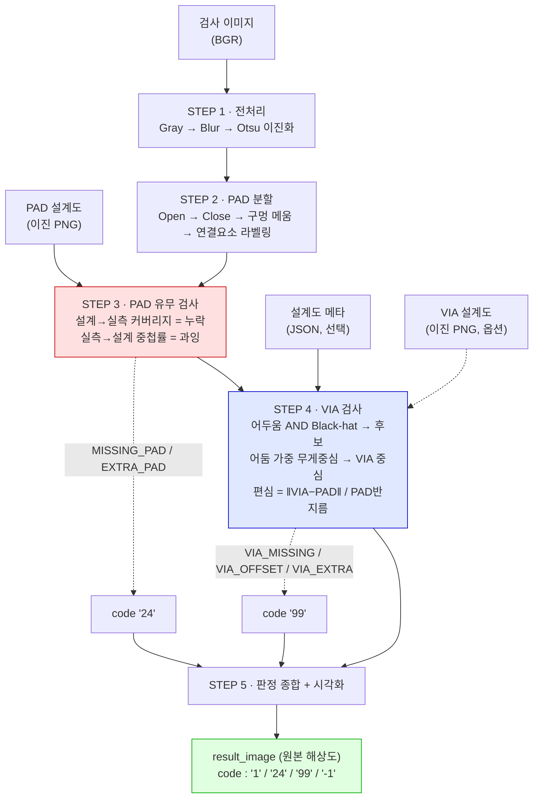
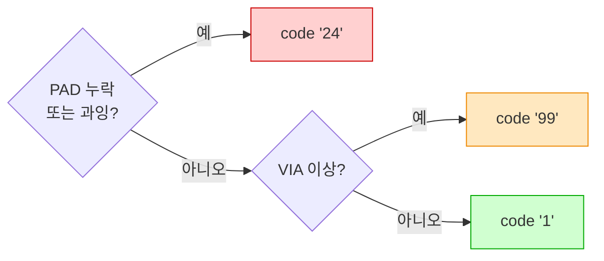
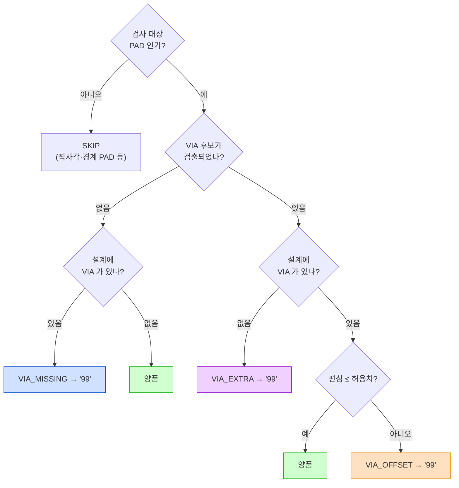
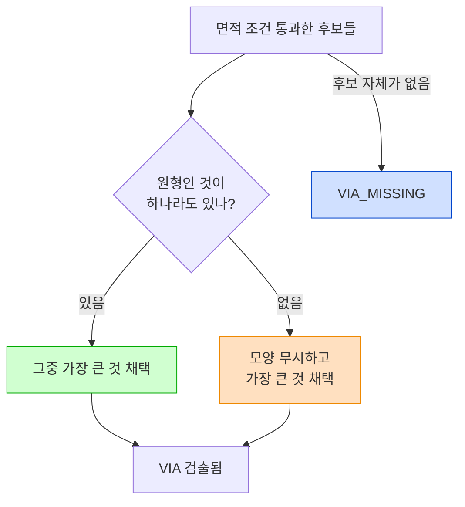
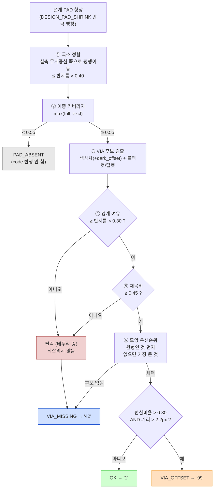

# PAD / VIA 검사기

PCB PAD 와 VIA(중앙 검은 점)를 설계도와 대조해 검사하는 순수 OpenCV 기반 파이프라인입니다.
딥러닝·학습 데이터 없이 **고전 영상처리만** 사용합니다.

| 코드 | 의미 |
|---|---|
| `"1"` | 양품 |
| `"24"` | PAD 누락 / PAD 과잉 (설계도 불일치) |
| `"99"` | VIA 없음 / VIA 편심(쏠림) / VIA 과잉 |
| `"-1"` | 처리 실패 |

> 판정 코드는 `int` 가 아니라 **`str`** 로 반환됩니다.

---

## 파일 구성

| 파일 | 역할 |
|---|---|
| **`pad_via_inspector.py`** | **검사 엔진 (단일 파일, 복붙용).** 이 파일 하나만 있으면 동작합니다 |
| **`via_checker.py`** | **VIA 검사만 떼어낸 단독 모듈.** 이미 준비된 이미지 4개를 받아 VIA만 판정 (없음 `"42"` / 쏠림 `"99"` 분리, 국소 정합·이중 커버리지 포함) |
| **`via_code.py`** | **판정 전용 단독 모듈.** VIA 이진화를 **직접 만들어 넣고** 코드 문자열만 받습니다. 이미지도 표도 안 만듭니다 |
| `make_testset.py` | 원본 이미지에 VIA·결함을 주입해 테스트셋과 설계도를 생성 |
| `run_inspection.py` | 테스트셋 전체를 검사하고 정답과 대조해 정확도 리포트 |
| `eval_padlevel.py` | PAD 단위 혼동행렬 + 편심 임계값 분리도 분석 |
| **[`GUIDE.md`](GUIDE.md)** | **`via_checker.py` · `via_code.py` 시각화 설명서.** 그림과 흐름도로 원리를 설명합니다 |
| `ALGORITHM.md` | **알고리즘·로직 상세 문서** (설계 근거, 실패 이력, 튜닝 가이드 포함) |

> `via_checker.py` 와 `via_code.py` 를 처음 쓴다면 **[GUIDE.md](GUIDE.md)** 부터 보세요.
> 두 모듈이 어떻게 VIA 를 찾고 판정하는지 흐름도와 그림으로 정리해 두었습니다.

의존성은 `opencv-python`, `numpy` 뿐입니다. **Python 3.9+**.

```bash
pip install opencv-python numpy
```

---

## 동작 원리

### 전체 파이프라인



`구멍 메움` 이 핵심입니다. VIA 는 PAD 안의 어두운 점이라 이진화하면 **PAD 에 구멍이 뚫린 형태**가 됩니다.
이 구멍을 메워야 PAD 를 온전한 덩어리로 셀 수 있고, 메워낸 구멍 자체가 VIA 후보가 됩니다.

### 판정 우선순위



PAD 자체가 틀렸다면 그 위의 VIA 판정은 의미가 없으므로 **`"24"` 가 `"99"` 보다 우선**합니다.
둘 다 발생하면 `code = "24"`, `codes = ["24", "99"]` 로 **모든 코드를 함께** 돌려줍니다.

### VIA 판정 로직



`설계에 VIA 가 있나?` 분기는 **`via_design_check=True` 일 때만** 실제로 갈라집니다.
꺼져 있으면 "검사 대상 PAD 에는 VIA 가 있어야 한다"가 기본 전제라 항상 `있음` 으로 처리되고,
따라서 `VIA_EXTRA` 는 발생하지 않습니다.

### 편심(offset) 계산

편심은 **PAD 등가반지름으로 정규화**하므로 PAD 크기가 달라도 같은 기준이 적용됩니다.

```
            ┌─────────────────┐
            │   설계 PAD 형상  │   ← 기준 형상은 설계도에서 가져온다
            │    ╭───────╮    │      (VIA 때문에 생긴 노치에 영향받지 않음)
            │   ╱    +    ╲   │   + = PAD 중심
            │  │     ↘     │  │   ● = VIA 중심 (어둠 가중 무게중심, 서브픽셀)
            │   ╲     ●   ╱   │   ↘ = 편심 벡터
            │    ╰───────╯    │
            └─────────────────┘

    offset_norm = ‖VIA중심 − PAD중심‖ / PAD등가반지름       (등가반지름 = √(면적/π))

    불량 판정 = (offset_norm > 0.25)  AND  (실제거리 > 2.2px)
                 └─ 상대 기준 ─┘         └─ 절대 하한 ─┘
```

**두 조건을 모두** 넘어야 불량입니다. 작은 PAD 에서는 1px 의 픽셀 양자화만으로도
상대 편심이 커 보이므로, 절대 하한이 없으면 오검출이 납니다.

### 실측 편심 분포 — 왜 이 임계값인가

테스트셋 746개 VIA 의 `offset_norm` 실측 분포입니다 (막대는 그룹별로 따로 정규화).

```
 offset_norm │ 정상 (center) n=705          │ 쏠림 (shift) n=41
─────────────┼──────────────────────────────┼────────────────────────────
  0.00–0.05  │ ████████████████████████ 578 │
  0.05–0.10  │ █████                    124 │
  0.10–0.15  │                          3   │
  0.15–0.20  │                          0   │
  0.20–0.25  │                          0   │
  0.25–0.30  │                          0   │   ← 판정 임계값 0.30
  0.30–0.35  │                          0   │        비어 있는 구간
  0.35–0.40  │                          0   │        (분리 마진)
  0.40–0.45  │                              │ ██████████████         6
  0.45–0.50  │                              │ ████████████           5
  0.50–0.55  │                              │ ███████████████████    8
  0.55–0.60  │                              │ ████████████████       7
  0.60–0.65  │                              │ ████████████████████████ 10
  0.65–0.70  │                              │ █████████              4
  0.70–0.75  │                              │ ██                     1
─────────────┴──────────────────────────────┴────────────────────────────
  정상 최댓값 0.110 │←── 분리 마진 0.313 ──→│ 0.423 쏠림 최솟값
```

두 분포 사이가 **완전히 비어 있습니다.** 임계값을 0.15 ~ 0.40 중 어디에 두어도 결과가 같습니다.
즉 **파라미터를 데이터에 맞춰 끼워맞춘 것이 아닙니다.**

> 정상 쪽이 예전(최댓값 0.131)보다 더 조여진 것은 테스트셋의 PAD 형상을 전부
> 같은 정사각으로 균일화했기 때문입니다. 설계 PAD 무게중심이 형상 편차 없이
> 정확히 잡히므로 편심 기준점이 흔들리지 않습니다.
> ([테스트셋 재생성](#테스트셋-재생성-선택) 참고)

### 결과 이미지 마커

```
   ┌────────────────────────────────────────────┐
   │   ╭──────╮        ╭──────╮                 │
   │   │  ╶┼╴ │        │  ╶┼╴↘│      ╭┄┄┄┄╮     │
   │   ╰──────╯        ╰──────╯      ┆ ✕  ┆     │
   │    노랑 십자       주황 십자+화살표  빨강 원+X │
   │    VIA 정상        VIA 편심        PAD 누락  │
   │                                            │
   │   ╭──────╮        ╭──────╮      ╭┄┄┄┄╮     │
   │   │  ╶┼╴ │        │      │      ┆    ┆     │
   │   ╰──────╯        ╰──────╯      ╰┄┄┄┄╯     │
   │    보라 십자        파랑 원       자홍 원    │
   │    VIA 과잉         VIA 없음      PAD 과잉  │
   └────────────────────────────────────────────┘
     녹색 외곽선 = 정상 PAD
```

텍스트 바나 여백은 **그리지 않습니다.** `result_image.shape == 입력.shape` 이 항상 보장됩니다.

---

## 빠른 시작

### 1) 원샷 모드

```python
from pad_via_inspector import inspect
import cv2

res = inspect("board.png", "board_cad.png", "board_cad.json")

print(res.code)      # "1" / "24" / "99" / "-1"
print(res.codes)     # 예: ["24", "99"]
print(res.ok)        # True / False
print(res.message)   # 'MISSING_PAD x1, VIA_OFFSET x2'

cv2.imwrite("out.png", res.result_image)   # 입력과 동일 해상도

for d in res.defects:
    print(d.kind, d.pad_id, d.position, d.detail)
```

예외가 나도 던지지 않고 `code = "-1"` 인 결과 객체를 반환하므로,
배치 처리 중 한 장 때문에 전체가 멈추지 않습니다.

### 2) 단계별 모드 (중간 결과 확인)

```python
from pad_via_inspector import (InspectConfig, step1_preprocess, step2_segment_pads,
                               step3_check_pad_presence, step4_check_via, step5_render)

cfg  = InspectConfig()

pre  = step1_preprocess("board.png", cfg)          # 전처리 · 이진화
seg  = step2_segment_pads(pre, cfg)                # PAD 분할 · 구멍 메움
pres = step3_check_pad_presence(seg, "board_cad.png", cfg)   # PAD 누락/과잉  -> "24"
via  = step4_check_via(pre.bgr, seg, pres, "board_cad.json", cfg)  # VIA 검사 -> "99"
res  = step5_render(pre.bgr, seg, pres, via, cfg)  # 종합 · 시각화

print(pre.threshold, len(seg.pads), len(pres.missing), res.code)
```

각 단계 결과가 독립 객체이므로 **임의 단계만 교체·재실행** 할 수 있습니다.

### 3) CLI

```bash
python pad_via_inspector.py board.png board_cad.png \
       --meta board_cad.json --out result.png
```

판정 결과는 stdout 에 JSON 으로 출력됩니다. 프로세스 종료 코드는 **양품 0 / 불량 1**.

---

## VIA 설계도 대조 (옵션)

VIA 도 설계도가 있는 경우, **설계에 있는데 없는 VIA(`VIA_MISSING`)** 와
**설계에 없는데 있는 VIA(`VIA_EXTRA`)** 를 함께 잡을 수 있습니다.
기본값은 **꺼짐**이며, 껐을 때의 동작은 기존과 완전히 동일합니다.

VIA 설계도는 검사 이미지와 같은 크기의 **이진 PNG** 로, 설계상 VIA 가 있어야 할 위치에만 흰 점을 찍습니다.

```python
from pad_via_inspector import InspectConfig, inspect

cfg = InspectConfig(via_design_check=True)
res = inspect("board.png", "board_cad.png", "board_cad.json", cfg, "board_via.png")
```

```bash
python pad_via_inspector.py board.png board_cad.png --meta board_cad.json \
       --via-design board_via.png --out result.png
```

판정 규칙:

| 설계 VIA | 실물 VIA | 판정 |
|---|---|---|
| 있음 | 있음 · 정중앙 | 양품 |
| 있음 | 있음 · 쏠림 | `VIA_OFFSET` → `"99"` |
| 있음 | 없음 | `VIA_MISSING` → `"99"` |
| 없음 | 있음 | `VIA_EXTRA` → `"99"` |
| 없음 | 없음 | 양품 |

설계 마스크는 헬퍼로 만들 수 있습니다.

```python
from pad_via_inspector import build_via_design_mask
mask = build_via_design_mask((220, 220), [(150.5, 32.1), (180.6, 32.1)], radius=2)
```

---

## VIA 검사만 쓰기 — `via_checker.py`

이진화와 설계도가 **이미 준비되어 있고** VIA 판정만 필요할 때 쓰는 단독 모듈입니다.
`pad_via_inspector.py` 없이 **이 파일 하나만** 다른 프로젝트에 붙여 넣으면 됩니다.

```
   원본 이미지 ─┐                             ┌─→ code     "1" / "42" / "99" / "-1"
   이진화 마스크 ─┤                             │
   PAD 설계도  ─┤──→  check_via(4개)  ──────┼─→ result   마커가 그려진 결과 이미지
   VIA 설계도  ─┘         ↑                   │            (찾아낸 VIA 도 하늘색 원)
                     dark_offset=0            └─→ via_bin  검출한 VIA 의 이진화 마스크
                     (선택, 임계 조절)
```

> VIA 이진화를 **직접 하고 계시다면** 검출 단계가 필요 없습니다.
> 코드만 돌려주는 [`via_code.py`](#이진화를-직접-하는-경우--via_codepy) 를 쓰세요.

| code | 뜻 | 마커 |
|---|---|---|
| `"1"` | 양품 | 초록 원 |
| `"42"` | **VIA 없음** | 빨강 X |
| `"99"` | **VIA 쏠림** | 주황 원 + 편심 화살표 |
| `"-1"` | 입력 오류 (`result`·`via_bin` 모두 `None`) | — |

### 입력 4개

| # | 인자 | 내용 |
|---|---|---|
| 1 | `image` | 원본 이미지 (BGR/GRAY ndarray 또는 경로) |
| 2 | `bin_mask` | 원본의 이진화 결과 = 실측 PAD 마스크 |
| 3 | `pad_design` | PAD 설계도 (이진) |
| 4 | `via_design` | VIA 설계도 (이진) |

네 이미지는 **같은 해상도·같은 좌표계**여야 합니다. 크기가 다르면 조용히 리사이즈하지 않고 `"-1"` 로 실패합니다.

### 검사 대상

**VIA 설계도에 점이 찍힌 PAD만** 검사합니다.
VIA 설계도의 각 연결요소 무게중심이 어느 설계 PAD 안에 있는지로 대상을 결정하며,
설계상 VIA 가 없는 PAD 는 아예 건드리지 않습니다.

```python
from via_checker import check_via

code, result, via_bin = check_via("board.png", "board_bin.png",
                                  "pad_cad.png", "via_cad.png")

# code    : "1"  양품
#           "42" VIA 없음
#           "99" VIA 쏠림
#           "-1" 입력 오류 (result, via_bin 모두 None)
# result  : 원본과 같은 해상도의 결과 이미지 (ndarray, BGR)
# via_bin : 검출한 VIA 의 이진화 마스크 (ndarray, 0/255 단일채널)
```

한 이미지에 없음과 쏠림이 같이 있으면 **`"42"` 가 이깁니다** (결손이 위치오차보다 중대).

함수 하나, 필수 인자 4개, 반환 3개가 전부입니다. 설정 객체·플래그·CLI 인자 없음,
JSON 도 파일 저장도 하지 않습니다. 저장이 필요하면 호출한 쪽에서 `cv2.imwrite` 하면 됩니다.

### 선택 인자 `dark_offset` — 색상차 임계 조절

PAD 표면 얼룩을 VIA 로 잘못 잡으면 임계를 올려서 **색이 확실히 다른 것만** VIA 로
인정시킵니다.

```python
code, result, via_bin = check_via("board.png", "board_bin.png",
                                  "pad_cad.png", "via_cad.png",
                                  dark_offset=-25)
```

```
   색상차 = |화소BGR - PAD대표색BGR| 을 세 채널 더한 값 (L1)
   임계   = 색상차중앙값 + 3.5 × 로버스트편차 - dark_offset
                                                └─ 기본 0

   dark_offset ↓ (음수)   임계 높아짐 → 색이 확실히 다른 것만 VIA → 얼룩 무시, 연한 VIA 도 놓침
   dark_offset ↑ (양수)   임계 낮아짐 → 조금만 달라도 VIA        → 연한 VIA 검출, 얼룩도 딸려옴
```

부호 방향은 예전(밝기 기준)과 같습니다. **단위만** 밝기(0\~255)에서 세 채널 합으로
바뀌어 대략 3배 스케일이니, 예전에 `-8` 을 쓰셨다면 `-24` 쯤부터 보세요.
실제로 임계가 얼마가 됐는지는 `debug_via` 의 `rows[i]["dark_threshold"]` 로 확인합니다.

기준선이 PAD 마다 자기 색이라 보드 밝기·라인별 색 차이를 자동으로 흡수합니다.
`0` 을 그대로 두고 쓰는 것이 기본이고, 실측 49장에서도 기본값으로 충분했습니다.

> **만능이 아닙니다.** 얼룩이 진짜 VIA 만큼 색이 다르면 같이 사라집니다. 실측에서도
> 대비 0.45 짜리 연한 VIA 와 얕은 얼룩은 색상차가 겹쳐서, `dark_offset` 을 내리면
> 얼룩이 빠지는 대신 연한 VIA 가 `VIA_MISSING` 으로 빠졌습니다.
> `-15` 씩 조금만 옮기면서 `dark_threshold` 와 판정을 같이 보세요.

### 반환 3 — `via_bin` (검출한 VIA 의 이진화 마스크)

**판정의 근거가 된 VIA 픽셀 그 자체**입니다. 원본과 같은 해상도의 0/255 단일채널.

```
   원본 이미지                     via_bin
   ┌──────────────┐               ┌──────────────┐
   │ ▓▓▓▓   ▓▓▓▓ │               │              │
   │ ▓▓○▓   ▓▓ ▓▓ │   ──────→     │   ▪          │   ← 찾은 것만 흰색
   │ ▓▓▓▓   ▓▓▓▓ │               │              │      (오른쪽은 VIA 없음)
   └──────────────┘               └──────────────┘
```

무엇이 들어가고 무엇이 빠지는지가 중요합니다.

| | via_bin 에 |
|---|---|
| VIA 로 **채택한** 덩어리 | ✔ 들어감 |
| `VIA_MISSING` 인 PAD | ✘ 아무것도 안 찍힘 |
| `PAD_ABSENT` 인 PAD | ✘ 아무것도 안 찍힘 |
| 후보였다가 **면적 조건에서 탈락**한 덩어리 | ✘ 안 찍힘 |
| 검사 대상이 아닌 PAD (설계에 VIA 점 없음) | ✘ 안 건드림 |

즉 **흰 픽셀 = 이 판정의 근거**입니다. 후보 화소를 그대로 흘려보내지 않으므로
"왜 이렇게 판정했나"를 따로 재현할 필요가 없습니다.

```python
import cv2
n_via = cv2.connectedComponents(via_bin)[0] - 1      # 검출된 VIA 개수
cv2.imwrite("via_bin.png", via_bin)                  # 저장은 호출한 쪽에서
```

44장 실측 검증 — `via_bin` 의 덩어리와 판정 결과가 **정확히 1:1** 로 대응합니다.

| 항목 | 결과 |
|---|---|
| 덩어리 개수 vs VIA 검출 PAD 수 | **746 = 746** (불일치 0) |
| 짝 없는 유령 덩어리 | **0개** |
| 덩어리 무게중심 vs `via_center` | 최대 오차 **0.38px** |
| 정답 VIA 좌표 ±3px 안에 흰 픽셀 | **746 / 746** |
| VIA 없는 PAD 자리(±8px)에 흰 픽셀 | **0 / 26** |

### 디버깅

수치가 궁금하면 `debug_via` 를 쓰세요. 인자는 똑같고 `rows` 하나만 더 붙습니다.

```python
from via_checker import debug_via

code, result, via_bin, rows = debug_via("board.png", "board_bin.png",
                                        "pad_cad.png", "via_cad.png")
```

- PAD 별 수치가 표로 출력됩니다 (`quiet=True` 로 끄기)
- 결과 이미지에 **PAD 번호**가 함께 그려집니다
- `rows` 로 원시값을 직접 받습니다

```
code=42   검사대상 8개   OK=5  VIA_MISSING=1  VIA_OFFSET=2
 PAD 판정           PAD중심            VIA중심               편심px      편심비율     허용    VIA면적     장단비      반경편차      모양탈락      테두리탈락    PAD밝기     임계     덮임         정합이동
------------------------------------------------------------------------------------------------------------------------------------------------------------------
   1 OK           (23.0,42.0)      (22.6,42.2)         0.45    0.0486   0.30       29    1.00     0.231         -          -    102.0   63.2   1.00   (0.0,-0.0)
   2 OK           (93.0,42.0)      (92.9,41.8)         0.28    0.0297   0.30        9    1.00     0.252         -          -    103.0   63.9   1.00    (0.0,0.0)
   3 VIA_OFFSET   (178.8,65.1)     (173.2,64.3)        5.73    0.6143   0.30       25    1.75     0.282         -          -    106.0   65.7   0.84    (0.8,0.1) NG
   4 VIA_OFFSET   (92.8,119.2)     (95.4,115.8)        4.25    0.4558   0.30       26    1.20     0.231         -          -    108.0   67.0   1.00   (-0.2,0.2) NG
   6 OK           (161.0,129.0)    (161.4,128.6)       0.51    0.0550   0.30       10    1.00     0.236         -          -    103.0   63.9   1.00   (-0.0,0.0)
   7 OK           (208.0,141.0)    (208.3,141.3)       0.41    0.0441   0.30       27    1.00     0.233         -          -    104.0   64.5   1.00  (-0.0,-0.0)
   8 VIA_MISSING  (162.0,178.0)    -                      -         -   0.30        -       -         -         -          -    110.0   68.2   1.00    (0.0,0.0) NG
   9 OK           (57.1,185.0)     (56.6,185.0)        0.50    0.0531   0.30       34    1.17     0.236         -          -    105.0   65.1   1.00    (0.1,0.0)
```

읽는 법:

- **장단비 / 반경편차** — 채택한 VIA 의 모양. 전부 1.00~1.75 / 0.231~0.282 로
  "꽉 찬 원"(1.00 / 0.236) 근처입니다. 여기가 크게 벗어나면 노이즈를 잡은 것입니다.
- **모양탈락** — 원이 아니라 뒤로 밀린 후보 수. `-` 는 0 개, 즉 필터가 아무 일도 안 했다는 뜻입니다.
- **테두리탈락** — PAD 경계에 붙어 있어서 **아예 버린** 후보 수. 여기에 숫자가 뜨는데
  판정이 `VIA_MISSING` 이면 실물 PAD 테두리가 검게 나온 것을 걸러낸 것입니다
  (위 "(4) PAD 테두리를 VIA 로 오인하던 문제" 참고).
- **임계** — `PAD밝기 × 0.62 + dark_offset`. `dark_offset` 을 바꾸면 이 열이 움직입니다.
- **정합이동** — 설계도와 실물의 어긋남을 PAD 별로 얼마나 흡수했는지.
  정상 정합이면 0 근처, 설계도가 밀려 있으면 그만큼 값이 커집니다.

`rows` 의 각 원소 키:

| 키 | 내용 |
|---|---|
| `pad_id` | 결과 이미지에 찍힌 번호와 동일 |
| `status` | `OK` / `VIA_OFFSET` / `VIA_MISSING` / `PAD_ABSENT` |
| `pad_center`, `pad_radius`, `pad_area` | 설계 PAD 기하 (정합 보정 후) |
| `align_shift` | 국소 정합으로 설계 PAD 를 옮긴 양 `(dx, dy)` |
| `pad_coverage` | 실측 마스크가 설계 PAD 를 덮은 비율 (전체·VIA제외 중 큰 값) |
| `design_via` | VIA 설계 좌표 |
| `via_center`, `via_area` | 검출된 실물 VIA (없으면 `None`) |
| `via_aspect`, `via_radial_dev` | 채택한 VIA 의 모양 지표 (원 = 1.00 / 0.236) |
| `shape_rejected` | 모양이 원이 아니라 뒤로 밀린 후보 수 (되살아날 수 있음) |
| `edge_rejected` | 경계 여유·채움비에서 **탈락**한 후보 수 (안 되살아남) |
| `offset_px`, `offset_norm` | 편심 절대/상대값 |
| `pad_median` | PAD 밝기 중앙값 (참고용) |
| `dark_threshold` | 실제로 쓰인 **색상차 임계** (`dark_offset` 반영된 값) |

### 판정

| 설계 VIA | 실물 | 판정 | code |
|---|---|---|---|
| 있음 | 있음 · 정중앙 | `OK` | `"1"` |
| 있음 | 없음 | `VIA_MISSING` | `"42"` |
| 있음 | 있음 · 쏠림 | `VIA_OFFSET` | `"99"` |
| 있음 | 실물 PAD 자체가 없음 | `PAD_ABSENT` | code 에 반영 안 함 |

`PAD_ABSENT` 는 실측 이진 마스크가 설계 PAD 영역을 `PAD_PRESENT_MIN`(기본 0.55) 만큼도
덮지 못한 경우입니다. PAD 가 없으면 VIA 가 없는 것이 당연하므로 VIA 불량으로 세지 않습니다.
(PAD 누락은 `"24"` 영역 — `pad_via_inspector.py` 담당)

### 실물 이미지에서 나던 오판정 네 가지

**홀필링(구멍 메우기)은 쓰지 않습니다.** 대신 네 가지를 각각 원인 쪽에서 막습니다.

#### (1) 쏠림이 아닌데 쏠림으로 나오던 문제 — 국소 정합

원인은 VIA 가 아니라 **설계도와 실물의 어긋남**이었습니다.
편심은 `설계 PAD 중심 → 실물 VIA 중심` 으로 재는데, 설계도 자체가 밀려 있으면
VIA 는 제자리인데도 편심 벡터가 통째로 생깁니다.

```
   [ 보정 전 ]  설계도가 오른쪽 아래로 2px 밀린 상태

        실물 PAD                  설계 PAD (밀림)
       ┌────────┐                ┌ ─ ─ ─ ─ ┐
       │ ╭────╮ │                  ╭────╮        + = 설계 PAD 중심 (기준)
       │ │ ●  │ │      겹치면 →   │ + ●  │ │     ● = 실물 VIA (제자리)
       │ ╰────╯ │                  ╰────╯
       └────────┘                └ ─ ─ ─ ─ ┘

              편심 벡터 = +→●  ... VIA 는 안 움직였는데 쏠림으로 판정 ✗


   [ 보정 후 ]  설계 형상을 실측 무게중심 쪽으로 되돌림

       ┌────────┐
       │ ╭────╮ │        정합 이동 (dx,dy) = 실측 무게중심 − 설계 중심
       │ │ +●  │ │                          (최대 PAD반지름 × 0.40 으로 클램프)
       │ ╰────╯ │
       └────────┘
              편심 ≈ 0  ... 정상으로 복구 ✓
```

| 설계도 어긋남 | 보정 전 | 보정 후 |
|---|---|---|
| 0 px | OK 217 / OFFSET 10 | OK 217 / OFFSET 10 |
| 1 px | OK 217 / OFFSET 10 | OK 217 / OFFSET 10 |
| 2 px | OK 85 / OFFSET **147** | OK 217 / OFFSET 10 |
| 3 px | OK 0 / OFFSET **231** | OK 217 / OFFSET 10 |

**전역 정합은 쓰지 않습니다.** 설계 PAD 가 실물보다 작게 그려져 있어
겹침 면적이 ±2px 구간에서 평평(plateau)해지고, 최대값이 잡음으로 결정됩니다.
실제로 (0,0) 을 주입한 뒤 전역 정합을 걸었더니 OK 가 217 → 138 로 오히려 나빠졌습니다.

**이 보정이 진짜 쏠림을 지우지 않는 이유**

```
   정중앙 VIA                        쏠린 VIA
   ┌──────────┐                      ┌──────────┐
   │ ██████ │  구멍이 대칭            │ ██████ │  구멍이 왼쪽에 치우침
   │ ██ ○ ██ │  → 무게중심 그대로     │ ██○  ██ │  → 무게중심이 오른쪽으로 밀림
   │ ██████ │                        │ ██████ │
   └──────────┘                      └──────────┘
        정합 이동 ≈ 0                      정합이 PAD 를 오른쪽으로 옮김
                                           = VIA 는 상대적으로 더 왼쪽
        편심 그대로 작음                    편심이 오히려 커짐 ↑
```

즉 정합은 거짓 쏠림만 지우고 진짜 쏠림은 **증폭**합니다.

##### 정합이 언제 값을 하는가 — 설계 어긋남을 주입한 실측

PAD 형상을 균일화한 뒤로는 설계도와 실물이 이미 잘 맞아서, **어긋남이 없으면 정합은
아무 일도 하지 않습니다**(이동량 평균 0.033px, 85%는 정확히 0px). 값을 하는 구간은
설계도가 실제로 밀렸을 때입니다. 설계도를 통째로 (dx, dy) 만큼 평행이동시켜 재봤습니다.

| 설계 어긋남 | 정합 OFF (정상max / 쏠림min / 여유) | 정합 ON |
|---|---|---|
| (0, 0) | 0.110 / 0.423 / **+0.313** | 0.110 / 0.423 / **+0.313** |
| (1, 1) | 0.945 / 0.298 / **−0.647** ✗ | 0.110 / 0.423 / **+0.313** ✓ |
| (2, 2) | 0.802 / 0.210 / **−0.591** ✗ | 0.120 / 0.404 / **+0.284** ✓ |
| (3, 3) | 0.662 / 0.473 / −0.189 ✗ | 0.997 / 0.348 / −0.649 ✗ |
| (−2, 3) | 0.754 / 0.408 / −0.346 ✗ | 0.811 / 0.361 / −0.450 ✗ |

- **±2px 까지는 정합이 완전히 복구**합니다. 정합이 없으면 1px만 밀려도 정상 PAD 의
  편심이 0.945까지 치솟아 분리 여유가 음수(= 정상/쏠림 구분 불가)가 됩니다.
- **3px 부터는 정합도 못 살립니다.** 실제 이동량을 재보면 이유가 보입니다.

| 설계 어긋남 | 필요 이동량 | 실제 이동 mean / p95 / max | 상한 포화 비율 |
|---|---|---|---|
| (0, 0) | 0.00 px | 0.03 / 0.04 / 0.94 | 0.0 % |
| (1, 1) | 1.41 px | 1.41 / 1.41 / 1.87 | 0.0 % |
| (2, 2) | 2.83 px | 2.61 / 2.62 / 2.97 | 0.0 % |
| (3, 3) | 4.24 px | 3.30 / 3.32 / 3.59 | **96.6 %** |
| (−2, 3) | 3.61 px | 2.99 / 3.00 / 3.80 | 1.5 % |

  `ALIGN_MAX_RATIO = 0.40` × PAD 반지름(중앙값 9.32px) = **상한 3.73px**.
  (3,3)은 4.24px가 필요한데 상한에 막혀 96.6%가 포화하고 잔차 ≈0.9px 가 남습니다.
  (−2,3)은 포화는 아니지만 무게중심 추정 자체의 잔차(≈0.6px)가 남습니다.
  이 상한은 의도한 것입니다 — 풀어주면 정합이 VIA 구멍 쪽으로 끌려가
  **진짜 쏠림까지 지워버립니다.**
- 실무 함의: **설계도 정합 오차 2px 이내를 전제로 하는 모듈**입니다.
  그보다 크면 상위 단계에서 전역 정합(template matching 등)을 먼저 걸어야 합니다.

어긋남이 없을 때의 실측 분포는 [실측 편심 분포](#실측-편심-분포--왜-이-임계값인가)에
있습니다 (정상 최댓값 0.110 / 쏠림 최솟값 0.423 / 분리 여유 **0.313**).

#### (2) VIA 구멍 때문에 `PAD_ABSENT` 로 빠지던 문제 — 이중 커버리지

이진화에서 VIA 자리가 통째로 뚫리면 "PAD 가 설계를 덮은 비율"이 무너집니다.
**구멍을 메우지(hole filling) 않고**, 기준 영역을 두 가지로 재서 **큰 값**을 씁니다.

```
   실측 마스크 (VIA 자리가 뚫림)      기준 A : full          기준 B : excl
        ┌──────────┐                ┌──────────┐          ┌──────────┐
        │ ▓▓▓▓▓▓ │                  │ ██████ │            │ ██████ │
        │ ▓▓    ▓▓ │  ← 구멍         │ ██████ │            │ ██    ██ │ ← VIA 자리를
        │ ▓▓▓▓▓▓ │                  │ ██████ │            │ ██████ │    아예 뺌
        └──────────┘                └──────────┘          └──────────┘
                                    덮임 0.62 ✗            덮임 1.00 ✓
                                    (구멍만큼 깎임)         (구멍에 면역)

        cover = max(full, excl)  →  1.00  →  PAD 있음 ✓
```

반대로 실물 PAD 가 설계보다 작게 나온 경우(침식)에는 `full` 쪽이 강합니다.
큰 값을 쓰면 두 기준의 장점만 남습니다.

15장 268개 PAD 기준 `PAD_ABSENT` 오검출 개수 (정답 0):

| 주입 | `full` 만 | `excl` 만 | **`max(full, excl)`** |
|---|---|---|---|
| 없음 | 0 | 0 | **0** |
| VIA 구멍 r=2 | 0 | 0 | **0** |
| VIA 구멍 r=3 | 0 | 0 | **0** |
| VIA 구멍 r=4 | 0 | 0 | **0** |
| VIA 구멍 r=5 | **3** | 0 | **0** |
| VIA 구멍 r=6 | **7** | 0 | **0** |
| 실물 PAD 침식 1 | 0 | **268** | **0** |
| 실물 PAD 침식 2 | 8 | **268** | **8** |

어느 쪽도 단독으로는 양쪽을 못 버팁니다.

- `full` 만 쓰면 **구멍이 커질수록** 무너집니다 (r=6 에서 7개).
- `excl` 만 쓰면 **침식에 통째로** 무너집니다 (268개 = 전부). 제외 원반을 빼고 나면
  판정 기준이 얇은 테두리 링만 남아서, 실물이 1px 만 깎여도 커버리지가 0 으로 떨어집니다.
- `max` 는 모든 행에서 더 좋은 쪽을 따라갑니다.

(침식 2 의 8 은 실물 PAD 가 정말 사라진 경우라 맞는 판정입니다.)

> 예전 테스트셋(PAD 크기 제각각, 면적 67~3068)에서는 `full` 이 r=4 에서 이미 159개로
> 무너졌습니다. 지금 표에서 r=4 까지 버티는 것은 PAD 를 전부 같은 크기(17×17)로
> 균일화해 PAD 대비 구멍 비율이 작아졌기 때문이지, `full` 이 안전해진 것이 아닙니다.
> 실제 보드처럼 작은 PAD 가 섞이면 `excl` 쪽이 다시 필요합니다.

> `excl` 의 제외 반경은 `PAD반지름 × VIA_EXCLUDE_RATIO`(기본 0.75)이며
> 위치는 **VIA 설계도** 좌표를 씁니다. 실물에서 찾은 VIA 가 아니라 설계 좌표라서,
> VIA 가 아예 없는 PAD 에서도 기준이 흔들리지 않습니다.

#### (3) PAD 안 노이즈를 VIA 로 잘못 잡던 문제 — 모양 필터

PAD 표면의 긁힘 자국·얼룩도 PAD 대표색과 색이 다르기 때문에 VIA 후보로 올라옵니다.
**크기만 보면 진짜 VIA 보다 큰 경우가 많아** 그냥 두면 이겨버립니다.

```
   [ 크기로만 고를 때 ]                    [ 모양까지 볼 때 ]

   ┌────────────────┐                    ┌────────────────┐
   │  ╲             │  긁힘 면적 19      │  ╲             │  장단비 5.0 → 밀림
   │   ╲            │       ↓            │   ╲            │
   │      ●         │  VIA  면적 12      │      ◉         │  장단비 1.0 → 채택
   └────────────────┘                    └────────────────┘
        긁힘을 VIA 로 채택 ✘                  진짜 VIA 를 채택 ✔
```

두 가지 숫자로 재고, 둘 다 **크기와 무관한 무차원 값**이라 PAD 픽셀 크기가 달라져도 그대로 씁니다.

| 지표 | 정의 | 꽉 찬 원 | 잡아내는 것 |
|---|---|---|---|
| **장단비** | 외접 사각형 긴변 / 짧은변 | `1.00` | 길쭉함 (긁힘은 1px 폭) |
| **반경편차** | 중심까지 거리의 표준편차 / 등가반지름 | `0.236` (크기 무관) | 흩어짐 (ㄴ자·대각선·부스러기) |

임계값은 실측 분포의 빈 구간에 놓았습니다.

| | 장단비 | 반경편차 | 표본 |
|---|---|---|---|
| 진짜 VIA | 1.00 ~ **1.75** | 0.211 ~ **0.317** | 테스트셋 746개 |
| 임계값 | `VIA_MAX_ASPECT` = **2.2** | `VIA_MAX_RADIAL_DEV` = **0.45** | |
| 실물 노이즈 | **4.0** ~ 7.0 | **0.443** ~ 0.690 | `Nosie/` 실측 |

#### 모양 필터는 판정을 뒤집지 않습니다 — 후보 선택만 바꿉니다

이게 이 필터의 핵심 설계입니다. 모양 조건은 **"누가 VIA 인가"** 를 고를 때만 쓰고
**"VIA 가 없다"** 고 단정하는 데는 쓰지 않습니다.
원형 후보가 하나도 없으면 모양을 포기하고 가장 큰 것을 그냥 씁니다.



**왜 이렇게 했는가** — 처음에는 원이 아니면 그냥 탈락시켰습니다. 그랬더니 노이즈를
주입한 측정에서 필터를 켠 쪽이 **오히려 나빠졌습니다**.

원인은 **긁힘이 진짜 VIA 를 가로지르는 경우**였습니다. 둘이 한 덩어리로 붙어 길쭉해지는데,
이때 탈락시키면 후보가 하나도 안 남아 **멀쩡한 PAD 가 `VIA_MISSING`(코드 42) 으로 둔갑**합니다.

```
   ┌────────────────┐   ┌────────────────┐
   │      ●         │   │     ╲          │   긁힘 + VIA 가 붙어 장단비 2.67
   │   ╲            │ → │      ◍         │        ↓
   │                │   │                │   탈락시키면 → VIA_MISSING ✘
   └────────────────┘   └────────────────┘   대안 없으면 채택 → OK ✔
     따로 있을 때         겹칠 때
```

| | 탈락 방식 | 대안 있을 때만 밀어내는 방식 |
|---|---|---|
| 필터 때문에 **나빠진** PAD | **4개** | **0개** |
| 필터 덕분에 **좋아진** PAD | 2개 | **2개** |

구조상 나빠질 수가 없습니다. 필터가 후보를 하나도 안 남기는 상황에서는 필터가 없는 것과
똑같이 동작하기 때문입니다.

#### 모양 필터 실측

**깨끗한 이미지에서는 완전한 무동작(no-op)** 입니다. 진짜 VIA 746개 중 하나도 안 밀어냅니다.

| | OK | VIA_OFFSET | VIA_MISSING | PAD_ABSENT | 모양탈락 |
|---|---|---|---|---|---|
| 필터 ON | 705 | 41 | 26 | 5 | **0** |
| 필터 OFF | 705 | 41 | 26 | 5 | 0 |

노이즈를 주입했을 때 — 숫자는 **깨끗할 때 판정과 달라진 PAD 수**(적을수록 좋음, 총 777개).

| 주입한 노이즈 | 필터 OFF | 필터 ON | 밀어낸 후보 |
|---|---|---|---|
| 긁힘 1개 얕음 | 8 | **8** | 0 |
| 긁힘 1개 진함 | 8 | **8** | 0 |
| 긁힘 2개 진함 | 18 | **16** | 9 |
| 긁힘 짧음 5px | 16 | **16** | 8 |
| 긁힘 김 13px | 8 | **8** | 3 |

> **못 거르는 것도 적어 둡니다.** 이 두 지표는 **정사각형(반경편차 0.247)** 과
> **링 모양(0.132)** 을 원과 구분하지 못합니다. 원의 0.236 과 겹치거나 오히려 낮습니다.
> 실물에서 나오는 노이즈가 1px 폭 긁힘이라 일부러 다루지 않았습니다.
> 둥근 얼룩도 모양으로는 못 거릅니다 — 그건 `dark_offset` 담당입니다.
> **링은 바로 아래 (4) 에서 위치로 따로 잡습니다.**

#### (4) PAD 테두리를 VIA 로 오인하던 문제 — 경계 여유

**넷 중 가장 심각한 것이었습니다.** 앞의 셋은 멀쩡한 것을 불량이라고 하는 오류였지만
이건 **불량을 양품이라고 하는(놓치는) 오류**였습니다.

실물 이미지에서 PAD 테두리를 한 바퀴 두른 어두운 링이 VIA 후보로 올라왔습니다.

```
   실제로 일어난 일                     검출된 것 (빨강)
   ┌──────────────┐                   ┌──────────────┐
   │  ╭────────╮  │                   │  ╭████████╮  │  ← 테두리 링을
   │  │        │  │                   │  █        █  │     VIA 로 채택
   │  │  (없음) │  │                   │  █ (없음)  █  │
   │  │        │  │                   │  █        █  │   무게중심 = PAD 중심
   │  ╰────────╯  │                   │  ╰████████╯  │   → 편심 0.00 → OK
   └──────────────┘                   └──────────────┘
     VIA 가 아예 없는 PAD                 양품으로 둔갑 (불량 놓침)
```

**앞의 필터로는 절대 못 잡습니다.** 링은 모양 지표상 완벽한 원이고, 편심도 0 입니다.

| | 장단비 | 반경편차 | 편심비율 | 모양 필터 | 편심 판정 |
|---|---|---|---|---|---|
| 진짜 VIA (꽉 찬 원) | 1.0 | 0.236 | — | 통과 | — |
| **테두리 링** | **1.0** | **0.13~0.20** | **0.00** | **통과** | **OK** |

실측입니다. `109-...Ref` 한 장에서 VIA 가 **하나도 없는** PAD 4개가 전부 OK 로 나왔습니다.
`테두리비율` 은 덩어리 픽셀 중 PAD 가장자리에 붙어 있는 비율입니다.

| PAD | 판정 | 면적 | 편심비율 | 테두리비율 |
|---|---|---|---|---|
| 8 | OK | 89 | 0.60 | **1.00** |
| 9 | OK | 86 | 0.71 | **1.00** |
| 11 | OK | 77 | 0.69 | **1.00** |
| 13 | OK | 66 | 0.73 | **1.00** |

##### 해결 — 모양이 아니라 위치를 봅니다

VIA 는 **PAD 안에 뚫린 구멍**이라 정의상 경계에서 떨어져 있습니다. 링은 경계에 붙어 있습니다.
그래서 덩어리 안에서 **PAD 경계로부터 가장 먼 픽셀의 거리**를 재고 PAD 반지름으로 나눕니다.

```
경계여유 = max(거리변환(설계PAD)[덩어리 픽셀]) / PAD반지름
```

두 분포가 겹치지 않습니다.

| | 최소 | p1 | 중앙 | 최대 |
|---|---|---|---|---|
| 진짜 VIA (테스트셋 746개) | **0.536** | 0.644 | 0.965 | 0.973 |
| 실물 테두리 링 (158개) | 0.075 | 0.086 | **0.254** | 0.795 |

임계값 스윕입니다. `0.30` 은 진짜 VIA 최소값(0.536)에서 **1.8배 여유**가 있습니다.

| 임계 | 테스트셋 탈락 | 실물 탈락 |
|---|---|---|
| 0.10 | 0 / 746 | 21 / 158 |
| 0.20 | 0 / 746 | 90 / 158 |
| **0.30** | **0 / 746** | **144 / 158** |
| 0.40 | 0 / 746 | 149 / 158 |

##### 이건 '탈락' 입니다 — 모양 필터와 성격이 다릅니다

(3) 의 모양 필터는 **선호**라 후보가 없으면 되살아납니다. 경계 여유는 **하드 탈락**이라
되살아나지 않습니다. 코드에서도 되살림 후보(`alt`) 에 넣기 **전에** 걸러냅니다.

| | 모양 (장단비·반경편차) | 경계 여유 |
|---|---|---|
| 성격 | 선호 — 원형인 것을 먼저 고름 | **탈락** — 무조건 버림 |
| 후보가 다 걸리면 | 모양을 포기하고 가장 큰 것 채택 | **VIA 없음(42)** |
| 근거 | 모양은 노이즈가 붙으면 변함 | 위치는 변하지 않는 사실 |

경계에 붙은 덩어리가 VIA 인 경우는 **정의상 없기** 때문입니다.

##### 침식을 키우는 방식은 실패했습니다 (기록)

처음엔 탐색 영역을 `PAD_ERODE` 로 더 깎아 테두리를 제외하려 했습니다. **더 나빠졌습니다.**

| 침식 | OK | VIA_MISSING | 테두리탈락 |
|---|---|---|---|
| 1px (현재) | **705** | **26** | 0 |
| 3px | 661 | 71 | 0 |

연한 VIA 는 화소가 **4~5개뿐**이라 3px 만 깎아도 통째로 사라집니다.
`테두리탈락 0` 이 증거입니다 — 경계 여유 필터는 아무 일도 안 했고, 순전히 침식이
멀쩡한 VIA 45개를 죽였습니다. 그래서 침식은 **1px 로 되돌렸고**, 테두리 문제는
깎아서가 아니라 **위치를 보고** 막습니다. (`MORPH_OPEN` 이 연한 VIA 를 죽였던 것과 같은 실패입니다.)

##### 결과

| | 테스트셋 746 VIA | 실물 `109-...Ref` PAD 8/9/11/13 |
|---|---|---|
| 적용 전 | OK 705 / MISSING 26 | **OK (VIA 없는데 양품)** |
| 적용 후 | **OK 705 / MISSING 26** | **VIA_MISSING (42)** |

테스트셋은 **한 개도 안 변했고**(테두리탈락 0), 실물의 불량 놓침만 사라졌습니다.
`101-...Cur` PAD 3 과 `AAAAAA0823-23-...Cur` PAD 6 은 링에 가려져 있던 **진짜 VIA 를
새로 찾아냈습니다.**

#### 전체 흐름



④⑤ 는 **탈락**이고 ⑥ 은 **선호**입니다. ⑥ 에서 모든 후보가 모양에 걸려도 가장 큰 것을
그냥 쓰지만, ④⑤ 에서 걸린 것은 ⑥ 의 되살림 대상에 아예 들어가지 않습니다.

한 이미지 안에 `'42'` 와 `'99'` 가 섞이면 **`'42'` 가 최종 코드**가 됩니다.

### 튜닝

설정 객체 대신 **파일 상단의 모듈 상수**를 직접 고칩니다. 전부 한자리에 모여 있습니다.

```python
DESIGN_PAD_SHRINK = 2     # 설계 PAD 가 실물보다 작게 그려진 px (같게 그렸으면 0)
OFFSET_TOL        = 0.30  # 반지름 대비 허용 편심 (스케일 불변)
OFFSET_MIN_PX     = 2.2   # 절대 허용 편심 px (작은 PAD 반올림 오차 흡수)
COLOR_K           = 3.5   # VIA 후보 = 색상차중앙값 + 이 값 × 로버스트편차 를 넘는 픽셀
COLOR_FLOOR       = 6.0   # 로버스트편차 하한 (매끈한 PAD 에서 임계가 붕괴하는 것 방지)
PAD_PRESENT_MIN   = 0.55  # 실물 PAD 존재 판정 커버리지
VIA_EXCLUDE_RATIO = 0.75  # 커버리지에서 뺄 VIA 자리 반경 (PAD반지름 대비)
ALIGN_MAX_RATIO   = 0.40  # 국소 정합 최대 이동량 (PAD반지름 대비, 0 이면 정합 끔)
ALIGN_MARGIN      = 2     # 무게중심을 잴 때 설계 PAD 를 키울 px
ALIGN_MIN_COVER   = 0.30  # 창 안 실측 픽셀이 이 비율 미만이면 정합 생략
VIA_MAX_ASPECT     = 2.2   # 이보다 길쭉한 후보는 뒤로 밀어냄 (원 = 1.00)
VIA_MAX_RADIAL_DEV = 0.45  # 이보다 흩어진 후보는 뒤로 밀어냄 (꽉 찬 원 = 0.236)
VIA_MIN_CLEARANCE  = 0.30  # 경계 여유 하한 (PAD반지름 대비). 미만이면 탈락 = 테두리 링
VIA_MIN_FILL       = 0.45  # 채움비 하한 (면적/최소외접원). 미만이면 탈락 = 링·호
PAD_ERODE          = 1     # 탐색 영역 침식 px. 키우지 마세요 (연한 VIA 가 사라집니다)
```

`COLOR_K` 는 안 고쳐도 됩니다 — 같은 효과를 **호출할 때** `dark_offset` 으로 냅니다.
모양 두 값을 `1e9` 로 두면 필터가 꺼지지만, 깨끗한 이미지에서는 켜나 끄나 판정이
같으므로 끌 이유가 없습니다.

`OFFSET_TOL` 은 실측 분포(정중앙 최대 0.110 / 쏠림 최소 0.423) 사이에서
정중앙 쪽에 여유를 둔 값입니다. 정합 보정으로 여유가 0.313 까지 벌어져
0.25 → 0.30 으로 올려도 쏠림 검출을 놓치지 않습니다 (여유 0.123 남음).

임계값이 **반지름·면적·밝기 중앙값에 대한 비율**로 잡혀 있어서 PAD 픽셀 크기가 달라져도
그대로 씁니다. 검사 대상을 설계도로 정하므로 크기 기반 대상 선별이 아예 없습니다.
(x2 확대 이미지에서 그대로 동작하는 것을 확인했습니다.)

### 결과 이미지

`check_via` 의 **두 번째 반환값**(`result`)이 이것입니다. 원본과 같은 해상도에
**PAD 하나당 마커 하나**만 그립니다 (텍스트·여백 없음, 원본 ndarray 는 변형하지 않음).

> 사람이 보는 용도는 `result`, 다음 공정에 넘기는 용도는 **세 번째 반환값** `via_bin` 입니다.

| 판정 | 마커 |
|---|---|
| `OK` | 초록 원 |
| `VIA_OFFSET` | 주황 원 + PAD중심 → VIA중심 화살표 |
| `VIA_MISSING` | 빨강 X |
| `PAD_ABSENT` | 회색 원 |

여기에 더해 **찾아낸 VIA 자리마다 하늘색 원**이 판정과 무관하게 항상 그려집니다.

```
   ┌──────────────────────┐
   │    ╭─────╮           │   초록 큰 원  = 판정 (PAD 단위)
   │    │  ◌  │           │   하늘 작은 원 = 검출한 VIA (실제 덩어리 크기)
   │    ╰─────╯           │
   └──────────────────────┘
```

- 반지름은 실제 검출 덩어리 면적에서 계산합니다 (`√(면적/π)`, 최소 2px) — 눈으로 크기를 가늠할 수 있습니다.
- 중심에 1px 점을 함께 찍어 서브픽셀 중심 위치를 표시합니다.
- **오검출이면 엉뚱한 자리에 원이 그려져 바로 보입니다.** 이게 이 마커의 목적입니다.
- `VIA_MISSING` PAD 에는 그릴 것이 없으므로 안 그려집니다.

실측 확인 — 검출된 VIA 17개 전부 `via_center` 기준 **±4px 안에 하늘색 픽셀**이 있고,
입력 ndarray 는 변형되지 않습니다.

마커가 마음에 안 들면 `rows` 의 `pad_center` / `via_center` / `via_area` / `pad_radius` 로 직접 그리면 됩니다.

### 검증

44장 테스트셋 기준 — **PAD 772/772 = 1.0000**, 이미지 코드 **37/37 = 1.0000**
(`"1"` / `"42"` / `"99"` 3분류 기준).

| 기대 \ 판정 | OK | VIA_OFFSET | VIA_MISSING |
|---|---|---|---|
| OK (정중앙) | **705** | 0 | 0 |
| 쏠림 | 0 | **41** | 0 |
| 없음 | 0 | 0 | **26** |

> 이미지가 44 가 아니라 37 인 이유: PAD 결함(`"24"`) 이미지 7장은 PAD 검사 담당이라
> VIA 코드 집계에서 뺐습니다. PAD 772 개에 VIA 과잉 11개는 포함되지 않습니다 —
> `via_checker.py` 는 **VIA 설계도에 점이 있는 PAD 만** 훑으므로 설계에 없는 VIA 는
> 구조상 검사 범위 밖입니다. 그 항목이 필요하면 `pad_via_inspector.py` 의
> `via_design_check=True` 를 쓰세요.

#### VIA 대비별 정확도

VIA 코어 밝기를 PAD 밝기의 0.12 / 0.25 / 0.45 배 세 단계로 균등하게 섞어 만든
테스트셋입니다. 0.45 는 눈으로도 겨우 보이는 수준의 흐린 VIA 입니다.

| 코어 밝기 | 설명 | 정확도 |
|---|---|---|
| `0.12` | 진함 | **263 / 263 = 1.0000** |
| `0.25` | 중간 | **246 / 246 = 1.0000** |
| `0.45` | 연함 | **237 / 237 = 1.0000** |

이 3단계를 넣자마자 **연한 VIA 5개가 `VIA_MISSING` 으로 새는 버그**가 드러났습니다.
원인은 후보 화소를 정리하던 `MORPH_OPEN 2×2` 였습니다.

```
연한 VIA 한 개의 검출 단계별 잔존 화소 수 (당시 조건 = 어둡기. PAD 밝기 107, 임계 66)

  1차 조건 통과          ██████                     5 px
  블랙햇 통과            (같은 자리 전부 통과)         5 px
  AND 후보              ██████                     5 px
  MORPH_OPEN 2x2 후    (없음)                      0 px   ← 여기서 전멸
```

5px 짜리 십자/대각 모양은 2×2 정사각을 품지 못해 열림 연산에 통째로 지워집니다.
진한 VIA 는 후보가 20~35px 라 멀쩡하지만, 연한 VIA 는 임계를 넘는 화소가
5개뿐이라 그대로 사라집니다. **열림 연산을 빼고 연결성분 면적 하한(`VIA_MIN_AREA = 4`)
하나로만 잡티를 거르도록** 고쳤습니다. 1차 조건과 블랙햇 두 조건을 동시에 통과한 화소가
우연히 4개나 이어질 확률은 낮아서, 잡티 제거 능력은 그대로입니다.

> 이 기록의 1차 조건은 당시 쓰던 **어둡기**입니다. 지금은 **색상차**로 바뀌었지만
> 화소 수가 적다는 성질은 같으므로 열림 연산 금지는 그대로 유효합니다.

| | PAD 정확도 | 이미지 | 연함 | 분리 여유 |
|---|---|---|---|---|
| `MORPH_OPEN 2×2` (기존) | 766/772 = 0.9922 | 36/37 | 231/237 | 0.218 |
| **면적 하한만 (현재)** | **772/772 = 1.0000** | **37/37** | **237/237** | **0.313** |
| 면적 하한 ≥ 5 | 766/772 = 0.9922 | 35/37 | 231/237 | 0.313 |
| 면적 하한 ≥ 6 | 757/772 = 0.9806 | 31/37 | 222/237 | 0.313 |

#### 실조건 주입

실조건을 인위로 주입한 15장(정답 OK 244 / OFFSET 14 / MISSING 10 / ABSENT 0):

| 주입 | OK | OFFSET | MISSING | ABSENT |
|---|---|---|---|---|
| 없음 | **244** | **14** | **10** | **0** |
| 설계 어긋남 (1,1) | **244** | **14** | **10** | **0** |
| 설계 어긋남 (2,2) | **244** | **14** | **10** | **0** |
| 설계 어긋남 (3,3) | 241 | 13 | 14 | 0 |
| 설계 어긋남 (-2,3) | 242 | **14** | 12 | 0 |
| VIA 구멍 r=2 | **244** | **14** | **10** | **0** |
| VIA 구멍 r=3 | **244** | **14** | **10** | **0** |
| VIA 구멍 r=4 | **244** | **14** | **10** | **0** |
| 실물 PAD 침식 1 | **244** | **14** | **10** | **0** |
| 실물 PAD 침식 2 | **244** | 6 | **10** | 8 |
| 촬영 잡음 σ=3 | 243 | **14** | 11 | 0 |
| 촬영 잡음 σ=6 | 243 | **14** | 11 | 0 |
| 촬영 잡음 σ=10 | 241 | 13 | 14 | 0 |

- 설계도가 2px 어긋나도, VIA 구멍이 r=4 로 뚫려도, PAD 가 1px 깎여도 **정답 그대로**입니다.
- 침식 2 의 `ABSENT` 8 은 실물 PAD 가 정말로 사라진 경우라 맞는 판정입니다.
- 잡음이 심해지면 놓치는 쪽(`MISSING`)으로만 무너지고 **없는 불량을 만들어내지 않습니다**
  (`OK → OFFSET` 이 0). 열림 연산을 뺀 뒤에도 이 성질이 유지되는 것을 확인했습니다.

#### 예외 입력

| 입력 | 결과 |
|---|---|
| 흑백 원본 / `float` 원본 / 3채널 설계도 / 0·1 스케일 마스크 | 정상 판정 |
| PAD 설계도 전부 0 / VIA 설계도 전부 0 / 이진화 전부 0·255 | 예외 없이 코드 반환 |
| VIA 를 전부 지운 이미지 | `"42"` |
| 크기 불일치 / 없는 경로 / `None` | `"-1"` + 사유 출력 |
| 1×1 이미지 | 예외 없이 코드 반환 |

15가지 전부 통과합니다.

---

## 이진화를 직접 하는 경우 — `via_code.py`

VIA 이진화를 **이미 직접 하고 계신 경우**를 위한 판정 전용 모듈입니다.
VIA 를 찾지 않고 **판정만** 합니다. `(코드, 결과이미지)` 둘이 나옵니다.

```python
from via_code import check_via_code

code, result = check_via_code(VIA이진화, PAD설계도, VIA설계도, bin_mask=이진화)

# code   : "1" 양품 / "42" VIA 없음 / "99" VIA 쏠림 / "-1" 입력 오류(result 는 None)
# result : 판정 마커를 그린 BGR 이미지 (입력과 같은 해상도)

cv2.imwrite("result.png", result)
```

### `via_checker.py` 와 무엇이 다른가

| | `via_checker.py` | `via_code.py` |
|---|---|---|
| 하는 일 | VIA 를 **찾고** 판정 | 판정**만** |
| 입력 | 원본 + 이진화 + 설계도 2장 | **VIA 이진화** + 설계도 2장 (+ 이진화 + 원본) |
| 반환 | `(code, 결과이미지, via_bin)` | **`(code, 결과이미지)`** |
| VIA 검출 | 색상차 + 블랙햇/탑햇 | **사용자가 준 마스크 그대로** |
| 판정 기준 | 편심·경계여유·채움비·면적·모양 | **동일** |

판정 기준이 같아서 `via_checker` 가 준 `via_bin` 을 그대로 넣으면 **같은 코드**가 나옵니다.

```python
code,  result,  via_bin = check_via(원본, 이진화, PAD설계도, VIA설계도)
code2, result2 = check_via_code(via_bin, PAD설계도, VIA설계도,
                                bin_mask=이진화, image=원본)
assert code2 == code        # 결과 이미지도 같은 마커 규칙으로 그려집니다
```

| 대조 | 결과 |
|---|---|
| 이미지 코드 일치 | **44 / 44** |
| PAD 판정 일치 | **777 / 777** |

### 결과 이미지의 바탕 — `image` 를 주면 그 위에, 안 주면 합성 배경에

이 모듈은 원본 사진을 받지 않는 게 기본이라(판정만 하니까) **그릴 바탕이 없습니다.**
그래서 원본을 안 주면 받은 마스크들을 회색조로 겹쳐 바탕을 만듭니다.

```
   image 를 준 경우              image 를 안 준 경우 (합성 배경)
   ┌──────────────────┐          ┌──────────────────┐
   │ 원본 사진 위에    │          │ 검정   빈 곳      │
   │ 마커만 얹음       │          │ 진회색 PAD 설계도 │
   │                  │          │ 중간   실측 PAD   │
   │                  │          │ 밝은회 준 VIA     │
   └──────────────────┘          └──────────────────┘
        눈으로 보기 좋음              원본 없이도 확인 가능
```

마커는 그 위에 원색으로 그리므로 어느 쪽이든 구분됩니다.
**판정 결과는 배경과 무관하게 완전히 같습니다** (`image` 는 그리기에만 씁니다).

### `bin_mask` 는 되도록 같이 주세요

실측 PAD 마스크입니다. VIA 를 찾는 데는 안 씁니다(그건 이미 하셨으니까).
**기준점**을 잡는 데만 씁니다. 주면 두 가지가 켜집니다.

| | 안 주면 | 주면 |
|---|---|---|
| **국소 정합** | 설계도-실물 어긋남이 그대로 편심에 더해짐 → `"99"` 증가 | 계통 오차 제거 |
| **PAD 누락 구분** | PAD 가 없는 자리도 `"42"` | `PAD_ABSENT` 로 빼둠 |

실측으로 **테스트셋 44장 중 5장**이 이 차이 하나 때문에 `"1"` 대신 `"42"` 가 나왔습니다.
안 주면 `"42"` 는 "VIA 가 없다" 가 아니라 **"PAD 가 없거나 VIA 가 없다"** 라는 뜻이 됩니다.

### 사용자 이진화에 테두리 링이 섞여 있어도 안전합니다

[(4) 경계 여유](#4-pad-테두리를-via-로-오인하던-문제--경계-여유) 와 **채움비** 필터가
이 모듈에도 그대로 들어 있습니다.
직접 이진화하실 때 PAD 윤곽이 딸려 들어와도 **양품으로 둔갑하지 않습니다.**

| 넣은 마스크 | 결과 | 테두리탈락 |
|---|---|---|
| 중앙 VIA | `"1"` | 0 |
| 쏠린 VIA | `"99"` | 0 |
| **테두리 링만** (VIA 없음) | **`"42"`** | 1 |
| 테두리 링 + 중앙 VIA | `"1"` (VIA 를 제대로 고름) | 1 |
| 빈 마스크 | `"42"` | 0 |

### 왜 이렇게 판정했는지 보고 싶으면

```python
code, result = check_via_code(VIA이진화, PAD설계도, VIA설계도,
                              bin_mask=이진화, verbose=True)
```

반환값은 그대로 `(코드, 결과이미지)` 이고, 표가 추가로 찍히고 결과 이미지에 PAD 번호가
같이 달립니다 (표의 `PAD` 열과 대조하기 위해서입니다).

```
검사대상 17개   OK=17
 PAD 판정           PAD중심            VIA중심        편심px    편심비율   허용  VIA면적  모양탈락  테두리탈락   덮임
----------------------------------------------------------------------------------------------------------
   1 OK           (98.0,36.0)      (98.0,35.6)      0.42    0.0448  0.30      25       -        -   1.00
   2 OK           (151.0,36.0)     (151.2,36.0)     0.20    0.0215  0.30      10       -        -   1.00
   3 OK           (182.0,36.0)     (182.0,36.0)     0.00    0.0000  0.30      37       -        -   1.00
```

### 주의 — 상수를 한쪽만 고치면 판정이 갈립니다

튜닝 값은 `via_checker.py` 와 **같은 값을 복제**해 두었습니다.
두 모듈을 같이 쓰신다면 임계값을 바꿀 때 **양쪽 다** 고치세요.

```python
DESIGN_PAD_SHRINK = 2     OFFSET_TOL         = 0.30   OFFSET_MIN_PX      = 2.2
ALIGN_MAX_RATIO   = 0.40  VIA_MIN_AREA       = 4      VIA_MAX_AREA_RATIO = 0.25
VIA_MIN_CLEARANCE = 0.30  VIA_MIN_FILL       = 0.45
VIA_MAX_ASPECT    = 2.2   VIA_MAX_RADIAL_DEV = 0.45
PAD_PRESENT_MIN   = 0.55  VIA_EXCLUDE_RATIO  = 0.75
```

`COLOR_K`·`COLOR_FLOOR`·블랙햇·`PAD_ERODE` 는 **없습니다.**
VIA 를 찾는 단계가 없기 때문입니다.

---

## 결과 이미지

**원본과 동일한 해상도**에 마커만 그립니다. 텍스트 바나 여백은 추가하지 않습니다.
코드·메시지는 `res.code` / `res.message` 로 받아 호출 측에서 원하는 대로 표시하세요.
`InspectConfig(draw_overlay=False)` 로 두면 원본을 그대로 반환합니다.

| 표식 | 색 | 의미 |
|---|---|---|
| PAD 외곽선 | 녹색 | 정상 PAD |
| 십자 마커 | 노랑 | VIA 정상 |
| 십자 + 화살표 | 주황 | VIA 편심 |
| 십자 마커 | 보라 | VIA 과잉 |
| 원 + X | 빨강 | PAD 누락 |
| 원 | 자홍 | PAD 과잉 |
| 원 | 파랑 | VIA 없음 |

---

## 설계도 규약

| 입력 | 형식 | 필수 |
|---|---|---|
| 검사 이미지 | BGR 또는 그레이 | 필수 |
| PAD 설계도 마스크 | 이진 PNG (PAD=255). 실물보다 약 2px 작게 침식 | 필수 |
| 설계도 메타 | JSON (`pads[].via_expected` 등) | 선택 (있으면 정확도 향상) |
| VIA 설계도 마스크 | 이진 PNG (VIA 위치만 흰 점) | 선택 (`via_design_check=True` 일 때) |

메타 JSON 이 없어도 PNG 만으로 동작합니다. PAD 설계도는 헬퍼로 생성할 수 있습니다.

```python
from pad_via_inspector import segment_pad_mask, build_design_mask

pad_mask = segment_pad_mask("board.png")          # 실측 PAD 이진 마스크
cad_mask = build_design_mask(pad_mask, erode_px=2)  # 실물보다 2px 작은 설계도
```

---

## 검증 결과

원본 47장 중 VIA 대상 PAD 를 가진 **44장**으로 측정했습니다.
(PAD 형상 균일화 + VIA 대비 3단계를 적용한 재생성 테스트셋)

| 지표 | 설계 VIA 대조 OFF | 설계 VIA 대조 ON |
|---|---|---|
| 이미지 단위 정확도 | **44 / 44 = 1.000** | **44 / 44 = 1.000** |
| PAD 단위 정확도 | **783 / 783 = 1.0000** | **783 / 783 = 1.0000** |
| 편심 분리 마진 | **0.313** | 0.313 |

PAD 단위 혼동행렬 (설계 VIA 대조 ON):

| 정답＼판정 | OK | VIA_OFFSET | VIA_MISSING | VIA_EXTRA | SKIP | UNDETECTED |
|---|---|---|---|---|---|---|
| center (정중앙) | **705** | 0 | 0 | 0 | 0 | 0 |
| shift (쏠림) | 0 | **41** | 0 | 0 | 0 | 0 |
| none (VIA 없음) | 0 | 0 | **26** | 0 | 0 | 0 |
| extra (설계에 없는 VIA) | 0 | 0 | 0 | **11** | 0 | 0 |

- 대조 OFF 일 때 `extra` 11건은 `OK` 로 흡수됩니다(설계에 VIA 점이 없으면 비교할
  기준이 없으므로 "여분 VIA"라는 판정 자체가 성립하지 않음). 대조 ON 이면
  `VIA_EXTRA` 로 정확히 분리됩니다.

편심 분리 마진 0.313 = 정상 PAD 의 최악 오프셋(0.110)과 쏠림 PAD 의 최소 오프셋(0.423) 사이 간격.
임계값을 0.15 ~ 0.40 어디에 두어도 결과가 같습니다 — **파라미터에 과적합되지 않았습니다.**

> 이번 재생성 과정에서 **연한 VIA(코어 밝기 = PAD 밝기의 0.45배)를 통째로 놓치는
> 버그**를 찾아 고쳤습니다. 후보 화소에 걸어 두었던 `MORPH_OPEN 2×2` 가 4~5px짜리
> 십자/대각 모양 후보를 전부 지워버리고 있었습니다. 자세한 추적 과정은
> [VIA 대비별 정확도](#via-대비별-정확도)에 있습니다. **VIA 대비를 3단계로 넓히지
> 않았다면 드러나지 않았을 결함입니다.**

---

## 다른 크기의 실제 이미지에 적용할 때

**기본 설정 그대로는 동작을 보장하지 않습니다.** 실측 결과와 대응 방법입니다.

### ① 설계도 JSON 을 반드시 함께 넘기세요

크롭 범위나 여백이 달라지면 PAD 가 이미지 경계에 닿는지 여부(`touches_border`)가 바뀝니다.
JSON 이 없으면 VIA 검사 대상을 형상 휴리스틱으로 고르는데, 경계에 걸려 제외됐던 PAD 가
여백이 생기면서 갑자기 검사 대상이 되어 **양품이 `"99"` 로 뒤집힙니다.**

| 캔버스 확장 | x1 | x2 | x4 |
|---|---|---|---|
| JSON 메타 **없음** | 0.955 | **0.568** | **0.568** |
| JSON 메타 **있음** | **1.000** | **1.000** | **1.000** |

JSON 을 주면 검사 대상이 설계의 `via_expected` 로 확정되어 이 문제가 사라집니다.

### ② PAD 의 픽셀 크기가 다르면 파라미터를 보정하세요

문제는 이미지 해상도가 아니라 **PAD 가 몇 픽셀인가** 입니다.
이 저장소 기준은 PAD 등가반지름 ≈ 6px, VIA 코어 ≈ 4~5px 입니다.

| 배율 | 기본 설정 | 보정 후 |
|---|---|---|
| x0.5 | 0.364 | 0.614 |
| x1.5 | 0.977 | **1.000** |
| x2.0 | 0.909 | **1.000** |
| x3.0 | 0.864 | **1.000** |

면적 계열은 `s²`, 길이 계열은 `s` 로 스케일하면 확대는 완전히 복구됩니다.

```python
s = 실제_PAD_등가반지름 / 6.0        # 이 저장소 기준 대비 배율

cfg = InspectConfig(
    # 면적 계열 (s²)
    min_pad_area        = int(60   * s*s),
    min_extra_area      = int(120  * s*s),
    via_target_min_area = int(150  * s*s),
    via_target_max_area = int(4000 * s*s),
    via_min_blob        = max(4, int(4 * s*s)),
    # 길이 계열 (s)
    via_offset_min_px   = 2.2 * s,
    via_pad_erode       = max(1, round(1 * s)),
    blur_ksize          = int(3*s) | 1,   # 커널은 홀수여야 함
    open_ksize          = int(3*s) | 1,
    close_ksize         = int(3*s) | 1,
)
```

`via_offset_tol`(0.25) 과 `via_target_min_circularity`(0.72) 는 **비율 기반이라 보정 불필요**합니다.

### ③ 축소는 하지 마세요

x0.5 는 파라미터를 보정해도 0.614 가 한계입니다. VIA 코어가 4~5px 인데 절반이 되면
2px 로 뭉개져 **정보 자체가 소실**됩니다. 임계값 문제가 아니라 복구 불가능한 손실입니다.

### ④ 크기 불일치는 조용히 틀리지 않습니다

설계도와 검사 이미지의 크기가 다르면 자동 리사이즈하지 않고 `code = "-1"` 로 실패합니다.

```
이미지 220x220 vs 설계도 440x440 -> code='-1'
message: ERROR: 설계도 크기((440, 440))와 이미지 크기((220, 220))가 다릅니다.
```

### 새 데이터 붙일 때 순서

1. `run_inspection.py --one <이름>` 으로 STEP1/STEP2 중간 이미지를 **눈으로** 확인 → 이진화·PAD 분할 확정
2. `eval_padlevel.py` 로 **분리 마진**이 양수인지 확인
3. 마진이 음수면 임계값을 건드릴 게 아니라 전처리를 손봐야 합니다 ([`ALGORITHM.md`](ALGORITHM.md) §4.2, §4.3)

---

## 테스트셋 재생성 (선택)

저장소에는 이미지가 포함되어 있지 않습니다. 직접 만들려면 원본 이미지를 `Images/` 에 넣고,

```bash
python make_testset.py                  # testset/ 생성
python run_inspection.py                # 전체 검사 + 정확도
python run_inspection.py --via-design   # VIA 설계 대조까지 켜고 검사
python run_inspection.py --one <이름>    # 1장만 단계별 실행, 중간 이미지 저장
python eval_padlevel.py                 # PAD 단위 혼동행렬 + 분리도
```

### PAD 형상 균일화

원본 이미지에서 딴 PAD 는 모양·크기가 제각각이라(면적 67~3068, 종횡비 0.21~5.43)
검사 성능이 "알고리즘 탓인지 PAD 모양 탓인지" 구분되지 않습니다.
그래서 **PAD 자리는 원본 그대로 두고 모양만 전부 같은 정사각으로 다시 그립니다.**
배경·조명·노이즈는 실사 그대로 남습니다.

```
     원본 PAD (제각각)                  균일화 후
   ┌───────────────────┐          ┌───────────────────┐
   │  ●      ▬▬▬▬      │          │  ■        ■       │
   │        (트레이스)  │   ──▶    │                   │
   │    ▄▄       ●     │          │    ■        ■     │
   │   (사각)   (원형)  │          │                   │
   │ 면적 67~3068       │          │ 전부 17×17, 면적 277│
   │ 종횡비 0.21~5.43   │          │ 종횡비 1.000        │
   └───────────────────┘          └───────────────────┘
```

순서가 중요합니다. **다시 그린 뒤 재분할**해서, 설계도·정답·검사 입력이
모두 같은 균일 PAD 에서 나오게 합니다.

```
원본 → 분할 → PAD 지우고 정사각 재도색 → 다시 전처리 → 다시 분할
                                              │
                        ┌─────────────────────┼─────────────────────┐
                        ▼                     ▼                     ▼
                   설계도 (CAD)          정답 (GT)            검사 입력 (이진화)
                   13×13 정사각          균일 PAD 기준          17×17 정사각
```

실측 결과 (44장 761개 VIA 대상 PAD):

| 항목 | 균일화 전 | 균일화 후 |
|---|---|---|
| 면적 | 67 ~ 3068 (46배) | 228 ~ 278 (표준편차 1.8) |
| 종횡비 | 0.21 ~ 5.43 | **1.000** (표준편차 0.0000) |
| bbox | 제각각 | **761개 전부 17×17** |
| 설계도 bbox | 제각각 | **790개 중 788개가 13×13** |

```python
PAD_UNIFORM = True    # False 면 원본 PAD 형상 그대로 사용
PAD_SIDE    = 16      # 정사각 한 변(px). 면적 약 253 -> VIA 대상 범위 안
PAD_CORNER  = 2       # 모서리 라운드 반지름. 원형도 하한 0.72 여유 확보
PAD_MIN_GAP = 5       # 이웃 PAD 최소 간격. 정사각으로 바꿀 때 붙는 것 방지
```

> `PAD_CORNER` 가 필요한 이유: 완전한 정사각의 원형도는 π/4 ≈ 0.785 라
> VIA 대상 하한 0.72 에 아슬아슬하게 걸칩니다. 모서리를 2px 둥글리면 0.989 로 올라갑니다.

### VIA 대비 3단계

VIA 코어 밝기를 PAD 밝기의 **0.12 / 0.25 / 0.45 배** 세 단계로 균등하게 섞습니다.
이미지마다 round-robin 으로 돌리면 항상 진한 것부터 시작해 전체 집계가 치우치므로,
그릴 개수만큼 라벨을 만들어 **섞어서** 뽑습니다.

```
        진함 0.12          중간 0.25          연함 0.45
      ┌──────────┐      ┌──────────┐      ┌──────────┐
      │  ▓▓▓▓▓▓  │      │  ▓▓▓▓▓▓  │      │  ▓▓▓▓▓▓  │
      │  ▓▓ ██ ▓▓ │      │  ▓▓ ▓▓ ▓▓ │      │  ▓▓ ▒▒ ▓▓ │
      │  ▓▓▓▓▓▓  │      │  ▓▓▓▓▓▓  │      │  ▓▓▓▓▓▓  │
      └──────────┘      └──────────┘      └──────────┘
       실측 코어/PAD      실측 코어/PAD      실측 코어/PAD
       0.087~0.168       0.222~0.322       0.422~0.571
         263개             246개             237개
```

정답(`ground_truth.json`)의 각 VIA 항목에 `darkness`(수치)와
`darkness_level`(`dark`/`mid`/`light`)이 함께 기록되므로 대비별 정확도를 바로 집계할 수 있습니다.

```python
VIA_DARKNESS_LEVELS = (0.12, 0.25, 0.45)
VIA_DARKNESS_NAMES  = ("dark", "mid", "light")
```

이 3단계 덕분에 [연한 VIA 미검출 버그](#via-대비별-정확도)를 찾아냈습니다.
단일 대비(0.25)만 쓰던 예전 테스트셋에서는 100% 로 나와 드러나지 않던 문제입니다.

---

## 문서

알고리즘 상세 — 각 단계의 수식, 설계 판단 근거, 실패한 시도와 그 원인, 파라미터 튜닝 가이드는
[`ALGORITHM.md`](ALGORITHM.md) 를 참고하세요.
